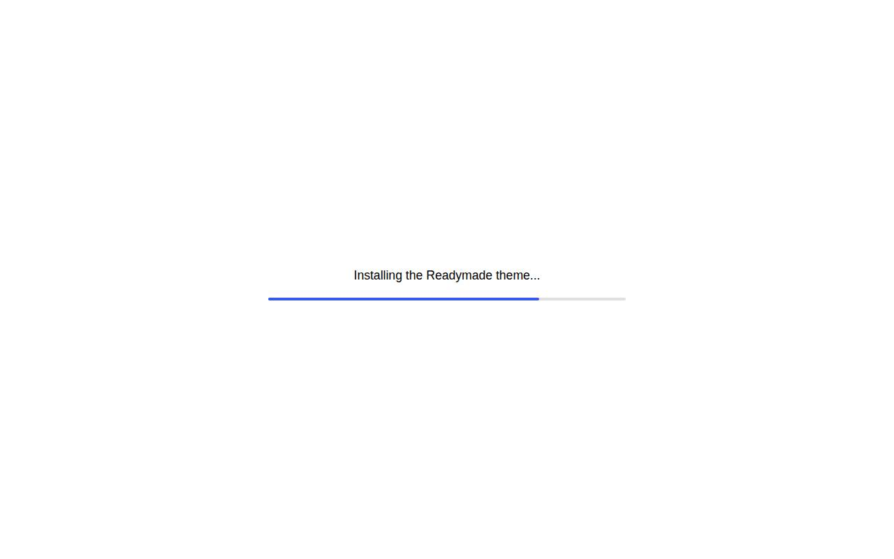
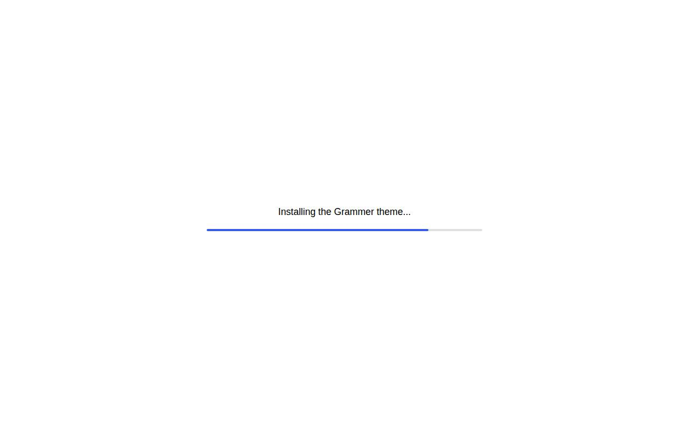
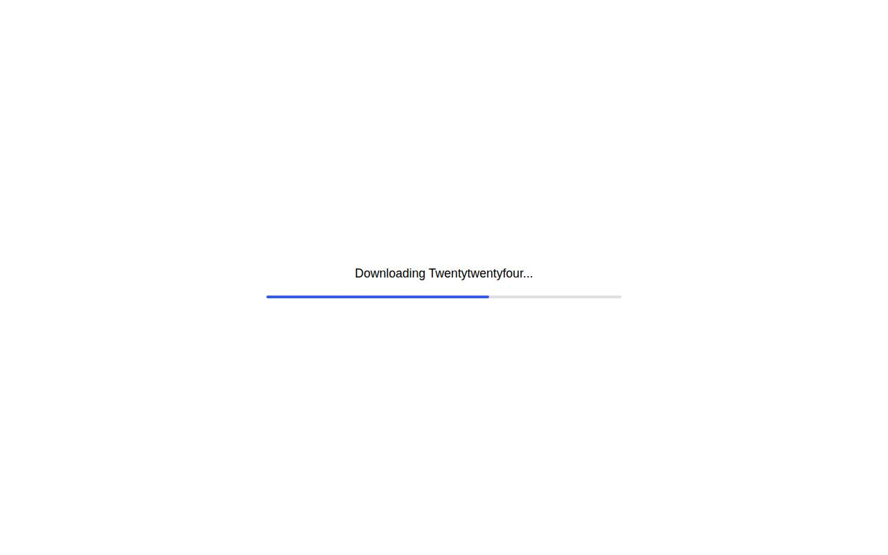
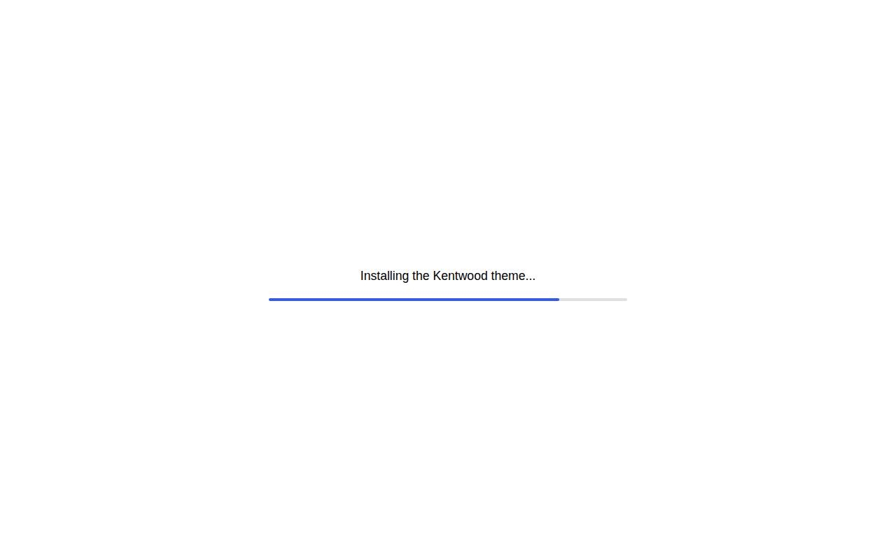
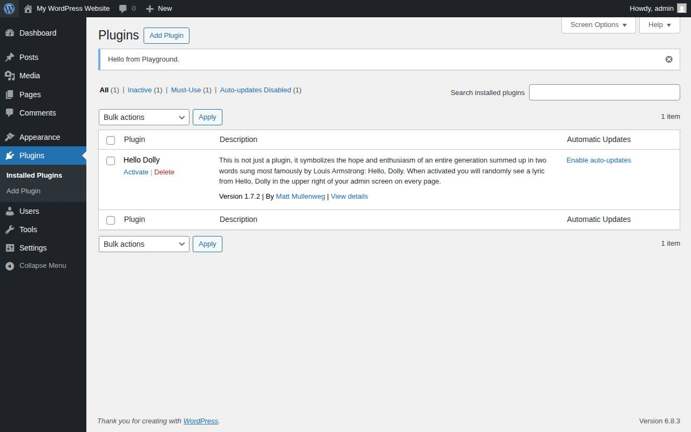
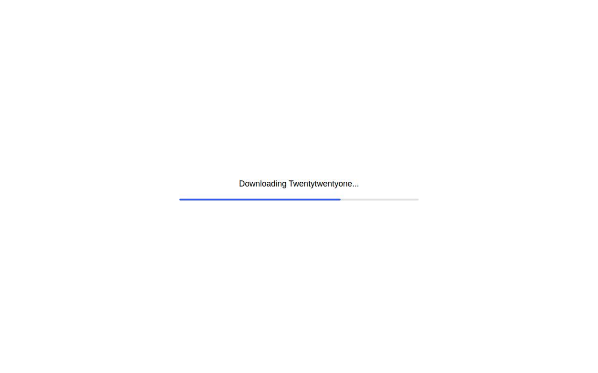
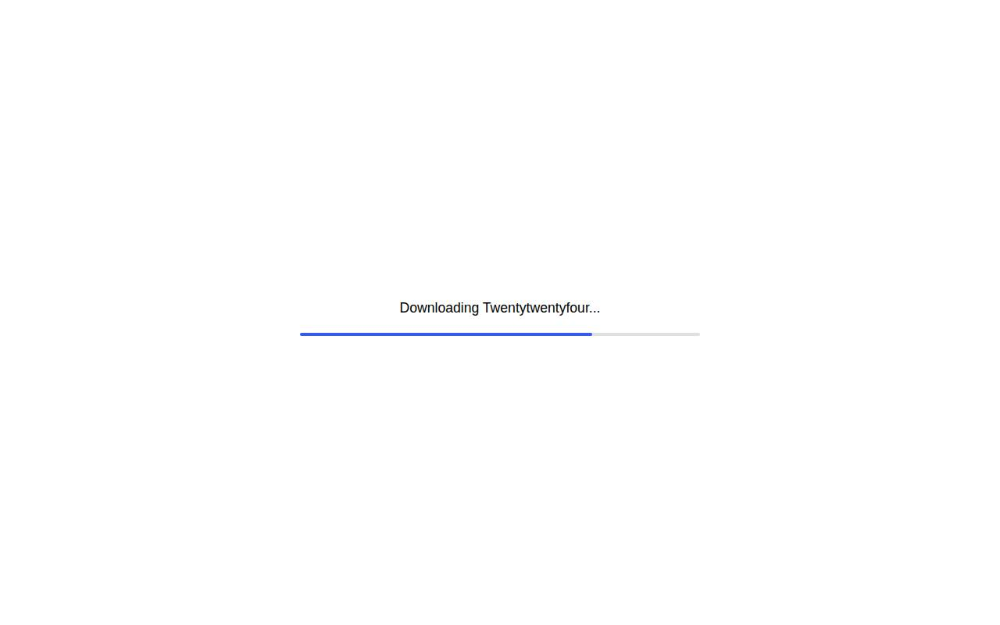
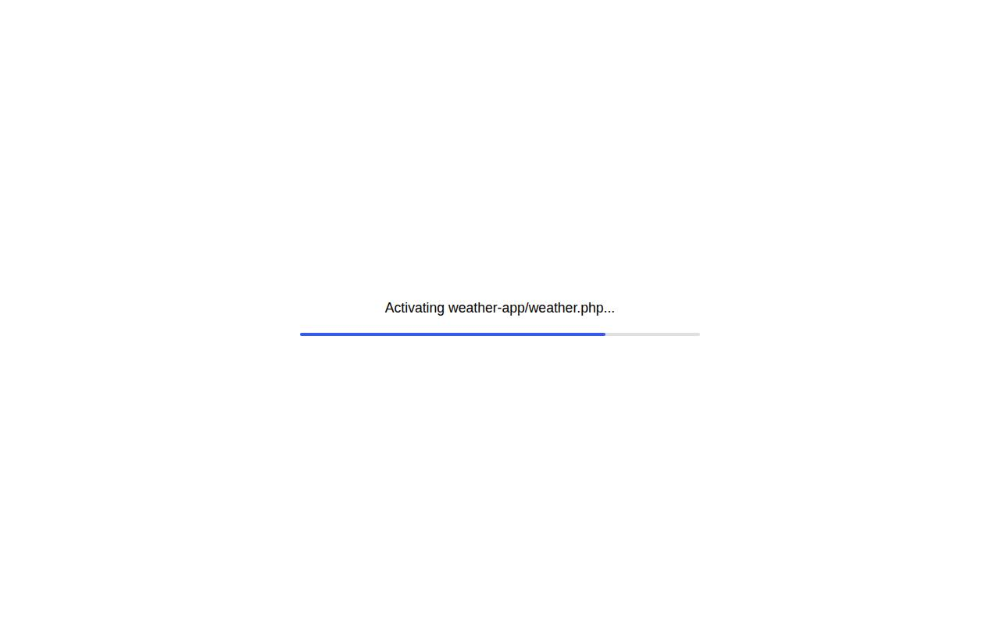

# WordPress Blueprints Gallery

Here's the list of all the community Blueprints submitted to this repository. See the [contribution guidelines](./README.md#contributing-your-blueprint) to submit your Blueprint and share your WordPress setup with the world!

| Title                                                                        | Description                                                                                                                                                                                                                                                                            | Author                                                       | Actions                                                                                                                                                                                                                                                                                                                                                                                                                                                                                                                                                               |
| -----                                                                        | -----------                                                                                                                                                                                                                                                                            | ------                                                       | -------                                                                                                                                                                                                                                                                                                                                                                                                                                                                                                                                                               |
| **Art Gallery**                                                              | An art gallery created with the Vueo theme.                                                                                                                                                                                                                                            | [@WordPress.com](https://github.com/WordPress.com)           | • [Open in Playground](https://playground.wordpress.net/?blueprint-url=https://raw.githubusercontent.com/wordpress/blueprints/trunk/blueprints/portfolio-vueo/blueprint.json) • [View source](https://github.com/wordpress/blueprints/blob/trunk/blueprints/portfolio-vueo/blueprint.json) • [Edit](https://playground.wordpress.net/builder/builder.html?blueprint-url=https://raw.githubusercontent.com/wordpress/blueprints/trunk/blueprints/portfolio-vueo/blueprint.json)                                                                                  |

| **Feed Reader with the Friends Plugin**                                      | By using the Friends plugin, you can read feeds from the web in Playground, and even via ActivityPub                                                                                                                                                                                   | [@akirk](https://github.com/akirk)                           | • [Open in Playground](https://playground.wordpress.net/?blueprint-url=https://raw.githubusercontent.com/wordpress/blueprints/trunk/blueprints/friends-cors/blueprint.json) • [View source](https://github.com/wordpress/blueprints/blob/trunk/blueprints/friends-cors/blueprint.json) • [Edit](https://playground.wordpress.net/builder/builder.html?blueprint-url=https://raw.githubusercontent.com/wordpress/blueprints/trunk/blueprints/friends-cors/blueprint.json)                                                                                        |

| **Gaming News**                                                              | A gaming news site created with the Spiel theme.                                                                                                                                                                                                                                       | [@WordPress.com](https://github.com/WordPress.com)           | • [Open in Playground](https://playground.wordpress.net/?blueprint-url=https://raw.githubusercontent.com/wordpress/blueprints/trunk/blueprints/news-spiel/blueprint.json) • [View source](https://github.com/wordpress/blueprints/blob/trunk/blueprints/news-spiel/blueprint.json) • [Edit](https://playground.wordpress.net/builder/builder.html?blueprint-url=https://raw.githubusercontent.com/wordpress/blueprints/trunk/blueprints/news-spiel/blueprint.json)                                                                                              |

| **Non-profit Organization**                                                  | A non-profit organization site created with the Koinonia theme.                                                                                                                                                                                                                        | [@WordPress.com](https://github.com/WordPress.com)           | • [Open in Playground](https://playground.wordpress.net/?blueprint-url=https://raw.githubusercontent.com/wordpress/blueprints/trunk/blueprints/organization-koinonia/blueprint.json) • [View source](https://github.com/wordpress/blueprints/blob/trunk/blueprints/organization-koinonia/blueprint.json) • [Edit](https://playground.wordpress.net/builder/builder.html?blueprint-url=https://raw.githubusercontent.com/wordpress/blueprints/trunk/blueprints/organization-koinonia/blueprint.json)                                                             |

| **Personal Blog**                                                            | A personal blog site created with the Substrata theme.                                                                                                                                                                                                                                 | [@WordPress.com](https://github.com/WordPress.com)           | • [Open in Playground](https://playground.wordpress.net/?blueprint-url=https://raw.githubusercontent.com/wordpress/blueprints/trunk/blueprints/personal-substrata/blueprint.json) • [View source](https://github.com/wordpress/blueprints/blob/trunk/blueprints/personal-substrata/blueprint.json) • [Edit](https://playground.wordpress.net/builder/builder.html?blueprint-url=https://raw.githubusercontent.com/wordpress/blueprints/trunk/blueprints/personal-substrata/blueprint.json)                                                                      |

| **Personal Resume**                                                          | A resume site created with the Readymade theme.                                                                                                                                                                                                                                        | [@WordPress.com](https://github.com/WordPress.com)           | • [Open in Playground](https://playground.wordpress.net/?blueprint-url=https://raw.githubusercontent.com/wordpress/blueprints/trunk/blueprints/personal-readymade/blueprint.json) • [View source](https://github.com/wordpress/blueprints/blob/trunk/blueprints/personal-readymade/blueprint.json) • [Edit](https://playground.wordpress.net/builder/builder.html?blueprint-url=https://raw.githubusercontent.com/wordpress/blueprints/trunk/blueprints/personal-readymade/blueprint.json)                                                                      |

| **Photography Portfolio**                                                    | A photography portfolio created with the Grammer theme.                                                                                                                                                                                                                                | [@WordPress.com](https://github.com/WordPress.com)           | • [Open in Playground](https://playground.wordpress.net/?blueprint-url=https://raw.githubusercontent.com/wordpress/blueprints/trunk/blueprints/portfolio-grammer/blueprint.json) • [View source](https://github.com/wordpress/blueprints/blob/trunk/blueprints/portfolio-grammer/blueprint.json) • [Edit](https://playground.wordpress.net/builder/builder.html?blueprint-url=https://raw.githubusercontent.com/wordpress/blueprints/trunk/blueprints/portfolio-grammer/blueprint.json)                                                                         |

| **Skincare Blog**                                                            | A skincare blog created with the Piel theme.                                                                                                                                                                                                                                           | [@WordPress.com](https://github.com/WordPress.com)           | • [Open in Playground](https://playground.wordpress.net/?blueprint-url=https://raw.githubusercontent.com/wordpress/blueprints/trunk/blueprints/news-piel/blueprint.json) • [View source](https://github.com/wordpress/blueprints/blob/trunk/blueprints/news-piel/blueprint.json) • [Edit](https://playground.wordpress.net/builder/builder.html?blueprint-url=https://raw.githubusercontent.com/wordpress/blueprints/trunk/blueprints/news-piel/blueprint.json)                                                                                                 |

| **Stylish Press**                                                            | A Woo store with custom theme, content, and products.                                                                                                                                                                                                                                  | [@adamziel](https://github.com/adamziel)                     | • [Open in Playground](https://playground.wordpress.net/?blueprint-url=https://raw.githubusercontent.com/wordpress/blueprints/trunk/blueprints/stylish-press/blueprint.json) • [View source](https://github.com/wordpress/blueprints/blob/trunk/blueprints/stylish-press/blueprint.json) • [Edit](https://playground.wordpress.net/builder/builder.html?blueprint-url=https://raw.githubusercontent.com/wordpress/blueprints/trunk/blueprints/stylish-press/blueprint.json)                                                                                     |

| **University Website**                                                       | A university website created with the Kentwood theme.                                                                                                                                                                                                                                  | [@WordPress.com](https://github.com/WordPress.com)           | • [Open in Playground](https://playground.wordpress.net/?blueprint-url=https://raw.githubusercontent.com/wordpress/blueprints/trunk/blueprints/organization-kentwood/blueprint.json) • [View source](https://github.com/wordpress/blueprints/blob/trunk/blueprints/organization-kentwood/blueprint.json) • [Edit](https://playground.wordpress.net/builder/builder.html?blueprint-url=https://raw.githubusercontent.com/wordpress/blueprints/trunk/blueprints/organization-kentwood/blueprint.json)                                                             |

| Create Block Theme                                                           | Blueprint to install Create Block Theme and start editing right away                                                                                                                                                                                                                   | [@jonathanbossenger](https://github.com/jonathanbossenger)   | • [Open in Playground](https://playground.wordpress.net/?blueprint-url=https://raw.githubusercontent.com/wordpress/blueprints/trunk/blueprints/create-block-theme/blueprint.json) • [View source](https://github.com/wordpress/blueprints/blob/trunk/blueprints/create-block-theme/blueprint.json) • [Edit](https://playground.wordpress.net/builder/builder.html?blueprint-url=https://raw.githubusercontent.com/wordpress/blueprints/trunk/blueprints/create-block-theme/blueprint.json)                                                                      |

| Creating a new user for the blog                                             | This is a simple example to update user meta data                                                                                                                                                                                                                                      | [@fellyph](https://github.com/fellyph)                       | • [Open in Playground](https://playground.wordpress.net/?blueprint-url=https://raw.githubusercontent.com/wordpress/blueprints/trunk/blueprints/user-meta/blueprint.json) • [View source](https://github.com/wordpress/blueprints/blob/trunk/blueprints/user-meta/blueprint.json) • [Edit](https://playground.wordpress.net/builder/builder.html?blueprint-url=https://raw.githubusercontent.com/wordpress/blueprints/trunk/blueprints/user-meta/blueprint.json)                                                                                                 |

| Custom Post Type: Books                                                      | Blueprint that added a custom post type to playground                                                                                                                                                                                                                                  | [@bph](https://github.com/bph)                               | • [Open in Playground](https://playground.wordpress.net/?blueprint-url=https://raw.githubusercontent.com/wordpress/blueprints/trunk/blueprints/custom-post/blueprint.json) • [View source](https://github.com/wordpress/blueprints/blob/trunk/blueprints/custom-post/blueprint.json) • [Edit](https://playground.wordpress.net/builder/builder.html?blueprint-url=https://raw.githubusercontent.com/wordpress/blueprints/trunk/blueprints/custom-post/blueprint.json)                                                                                           |

| Demo of Twenty-Twenty-Five theme                                             | Blueprint with demo content for the Twenty-Twenty-Five default theme                                                                                                                                                                                                                   | [@bph](https://github.com/bph)                               | • [Open in Playground](https://playground.wordpress.net/?blueprint-url=https://raw.githubusercontent.com/wordpress/blueprints/trunk/blueprints/tt5-demo/blueprint.json) • [View source](https://github.com/wordpress/blueprints/blob/trunk/blueprints/tt5-demo/blueprint.json) • [Edit](https://playground.wordpress.net/builder/builder.html?blueprint-url=https://raw.githubusercontent.com/wordpress/blueprints/trunk/blueprints/tt5-demo/blueprint.json)                                                                                                    |

| Display Admin Notice                                                         | Blueprint to add a tiny mu-plugin and display an admin notice                                                                                                                                                                                                                          | [@bph](https://github.com/bph)                               | • [Open in Playground](https://playground.wordpress.net/?blueprint-url=https://raw.githubusercontent.com/wordpress/blueprints/trunk/blueprints/admin-notice/blueprint.json) • [View source](https://github.com/wordpress/blueprints/blob/trunk/blueprints/admin-notice/blueprint.json) • [Edit](https://playground.wordpress.net/builder/builder.html?blueprint-url=https://raw.githubusercontent.com/wordpress/blueprints/trunk/blueprints/admin-notice/blueprint.json)                                                                                        |

| Enable all three Dataview Experiments in Gutenberg                           | Blueprint example to enable multiple Experiments within the Gutenberg plugin                                                                                                                                                                                                           | [@bph](https://github.com/bph)                               | • [Open in Playground](https://playground.wordpress.net/?blueprint-url=https://raw.githubusercontent.com/wordpress/blueprints/trunk/blueprints/gb-more-experiments/blueprint.json) • [View source](https://github.com/wordpress/blueprints/blob/trunk/blueprints/gb-more-experiments/blueprint.json) • [Edit](https://playground.wordpress.net/builder/builder.html?blueprint-url=https://raw.githubusercontent.com/wordpress/blueprints/trunk/blueprints/gb-more-experiments/blueprint.json)                                                                   |

| Fancy Dashboard Widget                                                       | A blueprint to display statistics about users, posts and comments on a WordPress site.                                                                                                                                                                                                 | [@muryamsultana](https://github.com/muryamsultana)           | • [Open in Playground](https://playground.wordpress.net/?blueprint-url=https://raw.githubusercontent.com/wordpress/blueprints/trunk/blueprints/fancy-dashboard_widget/blueprint.json) • [View source](https://github.com/wordpress/blueprints/blob/trunk/blueprints/fancy-dashboard_widget/blueprint.json) • [Edit](https://playground.wordpress.net/builder/builder.html?blueprint-url=https://raw.githubusercontent.com/wordpress/blueprints/trunk/blueprints/fancy-dashboard_widget/blueprint.json)                                                          |

| Grid Variations Experiments enabled                                          | Blueprint example to toggle on enable a feature from the Experiments page in Gutenberg plugin                                                                                                                                                                                          | [@bph](https://github.com/bph)                               | • [Open in Playground](https://playground.wordpress.net/?blueprint-url=https://raw.githubusercontent.com/wordpress/blueprints/trunk/blueprints/grid-variations/blueprint.json) • [View source](https://github.com/wordpress/blueprints/blob/trunk/blueprints/grid-variations/blueprint.json) • [Edit](https://playground.wordpress.net/builder/builder.html?blueprint-url=https://raw.githubusercontent.com/wordpress/blueprints/trunk/blueprints/grid-variations/blueprint.json)                                                                               |

| Import Theme Starter Content                                                 | Blueprint to install a theme with starter content, (here: Twenty-Twenty-One)                                                                                                                                                                                                           | [@bph](https://github.com/bph)                               | • [Open in Playground](https://playground.wordpress.net/?blueprint-url=https://raw.githubusercontent.com/wordpress/blueprints/trunk/blueprints/theme-starter-content/blueprint.json) • [View source](https://github.com/wordpress/blueprints/blob/trunk/blueprints/theme-starter-content/blueprint.json) • [Edit](https://playground.wordpress.net/builder/builder.html?blueprint-url=https://raw.githubusercontent.com/wordpress/blueprints/trunk/blueprints/theme-starter-content/blueprint.json)                                                             |

| Import a standalone starter content via a blueprint step                     | Blueprint to use a stand-alone starter content file and then to import it. Click on 'Subscriptions'                                                                                                                                                                                    | [@bph](https://github.com/bph)                               | • [Open in Playground](https://playground.wordpress.net/?blueprint-url=https://raw.githubusercontent.com/wordpress/blueprints/trunk/blueprints/file-starter-content/blueprint.json) • [View source](https://github.com/wordpress/blueprints/blob/trunk/blueprints/file-starter-content/blueprint.json) • [Edit](https://playground.wordpress.net/builder/builder.html?blueprint-url=https://raw.githubusercontent.com/wordpress/blueprints/trunk/blueprints/file-starter-content/blueprint.json)                                                                |

| Install WordPress language packs                                             | Installs and activates the latest WordPress Japanese translation pack from https://translate.wordpress.org/ – both for WordPress core and for the friends plugin.                                                                                                                      | [@adamziel](https://github.com/adamziel)                     | • [Open in Playground](https://playground.wordpress.net/?blueprint-url=https://raw.githubusercontent.com/wordpress/blueprints/trunk/blueprints/translations/blueprint.json) • [View source](https://github.com/wordpress/blueprints/blob/trunk/blueprints/translations/blueprint.json) • [Edit](https://playground.wordpress.net/builder/builder.html?blueprint-url=https://raw.githubusercontent.com/wordpress/blueprints/trunk/blueprints/translations/blueprint.json)                                                                                        |

| Install plugin from a gist                                                   | Install and activate a WordPress plugin from a .php file stored in a gist.                                                                                                                                                                                                             | [@zieladam](https://github.com/zieladam)                     | • [Open in Playground](https://playground.wordpress.net/?blueprint-url=https://raw.githubusercontent.com/wordpress/blueprints/trunk/blueprints/install-plugin-from-gist/blueprint.json) • [View source](https://github.com/wordpress/blueprints/blob/trunk/blueprints/install-plugin-from-gist/blueprint.json) • [Edit](https://playground.wordpress.net/builder/builder.html?blueprint-url=https://raw.githubusercontent.com/wordpress/blueprints/trunk/blueprints/install-plugin-from-gist/blueprint.json)                                                    |

| Latest Gutenberg plugin                                                      | A preview of the latest version of the Gutenberg plugin.                                                                                                                                                                                                                               | [@zieladam](https://github.com/zieladam)                     | • [Open in Playground](https://playground.wordpress.net/?blueprint-url=https://raw.githubusercontent.com/wordpress/blueprints/trunk/blueprints/latest-gutenberg/blueprint.json) • [View source](https://github.com/wordpress/blueprints/blob/trunk/blueprints/latest-gutenberg/blueprint.json) • [Edit](https://playground.wordpress.net/builder/builder.html?blueprint-url=https://raw.githubusercontent.com/wordpress/blueprints/trunk/blueprints/latest-gutenberg/blueprint.json)                                                                            |

| Loading, activating, and configuring a theme from a GitHub repository.       | This is a good example of typical steps used on a theme's loading, activation and configuration                                                                                                                                                                                        | [@richtabor](https://github.com/richtabor)                   | • [Open in Playground](https://playground.wordpress.net/?blueprint-url=https://raw.githubusercontent.com/wordpress/blueprints/trunk/blueprints/install-activate-setup-theme-from-gh-repo/blueprint.json) • [View source](https://github.com/wordpress/blueprints/blob/trunk/blueprints/install-activate-setup-theme-from-gh-repo/blueprint.json) • [Edit](https://playground.wordpress.net/builder/builder.html?blueprint-url=https://raw.githubusercontent.com/wordpress/blueprints/trunk/blueprints/install-activate-setup-theme-from-gh-repo/blueprint.json) |

| Login as an editor                                                           | Test WordPress functionality as an editor rather than an administrator.                                                                                                                                                                                                                | [@bacoords](https://github.com/bacoords)                     | • [Open in Playground](https://playground.wordpress.net/?blueprint-url=https://raw.githubusercontent.com/wordpress/blueprints/trunk/blueprints/login-as-editor/blueprint.json) • [View source](https://github.com/wordpress/blueprints/blob/trunk/blueprints/login-as-editor/blueprint.json) • [Edit](https://playground.wordpress.net/builder/builder.html?blueprint-url=https://raw.githubusercontent.com/wordpress/blueprints/trunk/blueprints/login-as-editor/blueprint.json)                                                                               |

| Markdown and Trac Syntax Editor                                              | Edit Markdown and Trac formatting in the block editor thanks to the blocky-formats plugin!                                                                                                                                                                                             | [@adamziel](https://github.com/adamziel)                     | • [Open in Playground](https://playground.wordpress.net/?blueprint-url=https://raw.githubusercontent.com/wordpress/blueprints/trunk/blueprints/blocky-formats/blueprint.json) • [View source](https://github.com/wordpress/blueprints/blob/trunk/blueprints/blocky-formats/blueprint.json) • [Edit](https://playground.wordpress.net/builder/builder.html?blueprint-url=https://raw.githubusercontent.com/wordpress/blueprints/trunk/blueprints/blocky-formats/blueprint.json)                                                                                  |

| Minimal WooCommerce Setup with Sample Products, Shipping, and Payment Method | To create a WordPress Playground instance that installs WooCommerce, adds a custom flat rate shipping method via a plugin, imports WooCommerce sample products XML to demonstrate the shipping method on the cart/checkout pages, and enables the Direct Bank Transfer payment method. | [@calvinrodrigues500](https://github.com/calvinrodrigues500) | • [Open in Playground](https://playground.wordpress.net/?blueprint-url=https://raw.githubusercontent.com/wordpress/blueprints/trunk/blueprints/woo-shipping/blueprint.json) • [View source](https://github.com/wordpress/blueprints/blob/trunk/blueprints/woo-shipping/blueprint.json) • [Edit](https://playground.wordpress.net/builder/builder.html?blueprint-url=https://raw.githubusercontent.com/wordpress/blueprints/trunk/blueprints/woo-shipping/blueprint.json)                                                                                        |

| Playground Welcome Landing Page                                              | Landing page for the WordPress Playground giving a quick overview of the features and capabilities of the platform.                                                                                                                                                                    | [@fellyph](https://github.com/fellyph)                       | • [Open in Playground](https://playground.wordpress.net/?blueprint-url=https://raw.githubusercontent.com/wordpress/blueprints/trunk/blueprints/welcome/blueprint.json) • [View source](https://github.com/wordpress/blueprints/blob/trunk/blueprints/welcome/blueprint.json) • [Edit](https://playground.wordpress.net/builder/builder.html?blueprint-url=https://raw.githubusercontent.com/wordpress/blueprints/trunk/blueprints/welcome/blueprint.json)                                                                                                       |

| Pretty permalinks                                                            | Set the permalink structure to use pretty permalinks.                                                                                                                                                                                                                                  | [@bgrgicak](https://github.com/bgrgicak)                     | • [Open in Playground](https://playground.wordpress.net/?blueprint-url=https://raw.githubusercontent.com/wordpress/blueprints/trunk/blueprints/use-pretty-permalinks/blueprint.json) • [View source](https://github.com/wordpress/blueprints/blob/trunk/blueprints/use-pretty-permalinks/blueprint.json) • [Edit](https://playground.wordpress.net/builder/builder.html?blueprint-url=https://raw.githubusercontent.com/wordpress/blueprints/trunk/blueprints/use-pretty-permalinks/blueprint.json)                                                             |

| Reset data and import content (with logs)                                    | It resets default data before importing custom content. It also logs the state of the content after each step.                                                                                                                                                                         | [@juanmaguitar](https://github.com/juanmaguitar)             | • [Open in Playground](https://playground.wordpress.net/?blueprint-url=https://raw.githubusercontent.com/wordpress/blueprints/trunk/blueprints/reset-data-and-import-content/blueprint.json) • [View source](https://github.com/wordpress/blueprints/blob/trunk/blueprints/reset-data-and-import-content/blueprint.json) • [Edit](https://playground.wordpress.net/builder/builder.html?blueprint-url=https://raw.githubusercontent.com/wordpress/blueprints/trunk/blueprints/reset-data-and-import-content/blueprint.json)                                     |

| Serve media files from another host                                          | Redirect any requests to files within the uploads directory to an external host. This is useful when you have a lot of image attachments in your playground but don’t want to include them all in the blueprint.                                                                       | [@ivanblagdan](https://github.com/ivanblagdan)               | • [Open in Playground](https://playground.wordpress.net/?blueprint-url=https://raw.githubusercontent.com/wordpress/blueprints/trunk/blueprints/redirect-upload-requests/blueprint.json) • [View source](https://github.com/wordpress/blueprints/blob/trunk/blueprints/redirect-upload-requests/blueprint.json) • [Edit](https://playground.wordpress.net/builder/builder.html?blueprint-url=https://raw.githubusercontent.com/wordpress/blueprints/trunk/blueprints/redirect-upload-requests/blueprint.json)                                                    |

| Set the admin color scheme                                                   | Set the admin color scheme to Modern using the updateUserMeta step.                                                                                                                                                                                                                    | [@ndiego](https://github.com/ndiego)                         | • [Open in Playground](https://playground.wordpress.net/?blueprint-url=https://raw.githubusercontent.com/wordpress/blueprints/trunk/blueprints/set-admin-color-scheme/blueprint.json) • [View source](https://github.com/wordpress/blueprints/blob/trunk/blueprints/set-admin-color-scheme/blueprint.json) • [Edit](https://playground.wordpress.net/builder/builder.html?blueprint-url=https://raw.githubusercontent.com/wordpress/blueprints/trunk/blueprints/set-admin-color-scheme/blueprint.json)                                                          |

| Showcase plugin                                                              | Showcase custom plugin from own server with media files and content imported as WXR. There is a readme file in github repository (https://github.com/Lovor01/blueprints/blob/trunk/blueprints/showcase-plugin-with-media/readme.md) which explains all steps.                          | [@Lovor01](https://github.com/Lovor01)                       | • [Open in Playground](https://playground.wordpress.net/?blueprint-url=https://raw.githubusercontent.com/wordpress/blueprints/trunk/blueprints/showcase-plugin-with-media/blueprint.json) • [View source](https://github.com/wordpress/blueprints/blob/trunk/blueprints/showcase-plugin-with-media/blueprint.json) • [Edit](https://playground.wordpress.net/builder/builder.html?blueprint-url=https://raw.githubusercontent.com/wordpress/blueprints/trunk/blueprints/showcase-plugin-with-media/blueprint.json)                                              |

| Theme Tester                                                                 | Blueprint example to add content and plugins to explore a theme                                                                                                                                                                                                                        | [@bph](https://github.com/bph)                               | • [Open in Playground](https://playground.wordpress.net/?blueprint-url=https://raw.githubusercontent.com/wordpress/blueprints/trunk/blueprints/theme-a11y-test/blueprint.json) • [View source](https://github.com/wordpress/blueprints/blob/trunk/blueprints/theme-a11y-test/blueprint.json) • [Edit](https://playground.wordpress.net/builder/builder.html?blueprint-url=https://raw.githubusercontent.com/wordpress/blueprints/trunk/blueprints/theme-a11y-test/blueprint.json)                                                                               |

| Use WPGraphQL to query WordPress                                             | Example that loads WordPress with WPGraphQL active and defaults to the WPGraphQL IDE page to allow users to test GraphQL queries and explore the GraphQL Schema.                                                                                                                       | [@jasonbahl](https://github.com/jasonbahl)                   | • [Open in Playground](https://playground.wordpress.net/?blueprint-url=https://raw.githubusercontent.com/wordpress/blueprints/trunk/blueprints/wpgraphql/blueprint.json) • [View source](https://github.com/wordpress/blueprints/blob/trunk/blueprints/wpgraphql/blueprint.json) • [Edit](https://playground.wordpress.net/builder/builder.html?blueprint-url=https://raw.githubusercontent.com/wordpress/blueprints/trunk/blueprints/wpgraphql/blueprint.json)                                                                                                 |

| Use wp-cli command to add posts                                              | Blueprint example to add posts via a wp-cli command.                                                                                                                                                                                                                                   | [@bph](https://github.com/bph)                               | • [Open in Playground](https://playground.wordpress.net/?blueprint-url=https://raw.githubusercontent.com/wordpress/blueprints/trunk/blueprints/posts-via-wp-cli/blueprint.json) • [View source](https://github.com/wordpress/blueprints/blob/trunk/blueprints/posts-via-wp-cli/blueprint.json) • [Edit](https://playground.wordpress.net/builder/builder.html?blueprint-url=https://raw.githubusercontent.com/wordpress/blueprints/trunk/blueprints/posts-via-wp-cli/blueprint.json)                                                                            |

| Use wp-cli to add a post with image                                          | Use wp-cli to create a post from text file with block markup and a featured image                                                                                                                                                                                                      | [@bph](https://github.com/bph)                               | • [Open in Playground](https://playground.wordpress.net/?blueprint-url=https://raw.githubusercontent.com/wordpress/blueprints/trunk/blueprints/wpcli-post-with-image/blueprint.json) • [View source](https://github.com/wordpress/blueprints/blob/trunk/blueprints/wpcli-post-with-image/blueprint.json) • [Edit](https://playground.wordpress.net/builder/builder.html?blueprint-url=https://raw.githubusercontent.com/wordpress/blueprints/trunk/blueprints/wpcli-post-with-image/blueprint.json)                                                             |

| Weather Shortcode Plugin                                                     | A blueprint to connetc weather API and show data as shortcode on a WordPress site.                                                                                                                                                                                                     | [@muryamsultana](https://github.com/muryamsultana)           | • [Open in Playground](https://playground.wordpress.net/?blueprint-url=https://raw.githubusercontent.com/wordpress/blueprints/trunk/blueprints/pwa-weather-app/blueprint.json) • [View source](https://github.com/wordpress/blueprints/blob/trunk/blueprints/pwa-weather-app/blueprint.json) • [Edit](https://playground.wordpress.net/builder/builder.html?blueprint-url=https://raw.githubusercontent.com/wordpress/blueprints/trunk/blueprints/pwa-weather-app/blueprint.json)                                                                               |

| WooCommerce product feed                                                     | Blueprint to create a WooCommerce product and export an XML/CSV product feed                                                                                                                                                                                                           | [@mujuonly](https://github.com/mujuonly)                     | • [Open in Playground](https://playground.wordpress.net/?blueprint-url=https://raw.githubusercontent.com/wordpress/blueprints/trunk/blueprints/woocommerce-product-feed/blueprint.json) • [View source](https://github.com/wordpress/blueprints/blob/trunk/blueprints/woocommerce-product-feed/blueprint.json) • [Edit](https://playground.wordpress.net/builder/builder.html?blueprint-url=https://raw.githubusercontent.com/wordpress/blueprints/trunk/blueprints/woocommerce-product-feed/blueprint.json)                                                    |

| WordPress Beta                                                               | Test the latest WordPress Beta or RC release with theme test data and debugging plugins. Only loads the Beta version during the Beta period.                                                                                                                                           | [@courtneyr-dev](https://github.com/courtneyr-dev)           | • [Open in Playground](https://playground.wordpress.net/?blueprint-url=https://raw.githubusercontent.com/wordpress/blueprints/trunk/blueprints/beta-rc/blueprint.json) • [View source](https://github.com/wordpress/blueprints/blob/trunk/blueprints/beta-rc/blueprint.json) • [Edit](https://playground.wordpress.net/builder/builder.html?blueprint-url=https://raw.githubusercontent.com/wordpress/blueprints/trunk/blueprints/beta-rc/blueprint.json)                                                                                                       |

