# WordPress Blueprints Gallery

Here's the list of all the community Blueprints submitted to this repository. See the [contribution guidelines](./README.md#contributing-your-blueprint) to submit your Blueprint and share your WordPress setup with the world!

<h2><strong>Art Gallery</strong></h2>

An art gallery created with the Vueo theme.

<small>By <a href="https://github.com/WordPress.com">@WordPress.com</a> • <a href="https://github.com/wordpress/blueprints/blob/trunk/blueprints/portfolio-vueo/blueprint.json">View source</a> • <a href="https://playground.wordpress.net/builder/builder.html?blueprint-url=https://raw.githubusercontent.com/wordpress/blueprints/d17b1bb6a5f6b2b3293625804a4f2a73284052f3/blueprints/portfolio-vueo/blueprint.json">Edit</a></small>

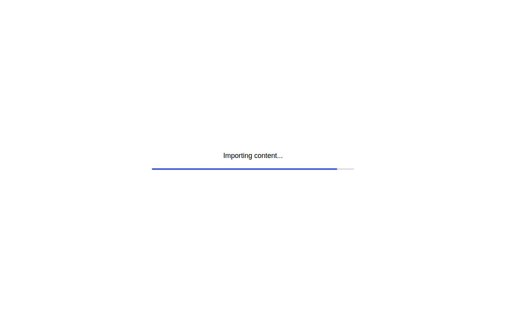

 

<h2><strong>Coffee Shop</strong></h2>

A stylish WooCommerce coffee shop storefront with custom theme, products, and content.

<small>By <a href="https://github.com/adamziel">@adamziel</a> • <a href="https://github.com/wordpress/blueprints/blob/trunk/blueprints/brewcommerce/blueprint.json">View source</a> • <a href="https://playground.wordpress.net/builder/builder.html?blueprint-url=https://raw.githubusercontent.com/wordpress/blueprints/49ec479bc669a754d3e9e10269ff1e9fde88df95/blueprints/brewcommerce/blueprint.json">Edit</a></small>

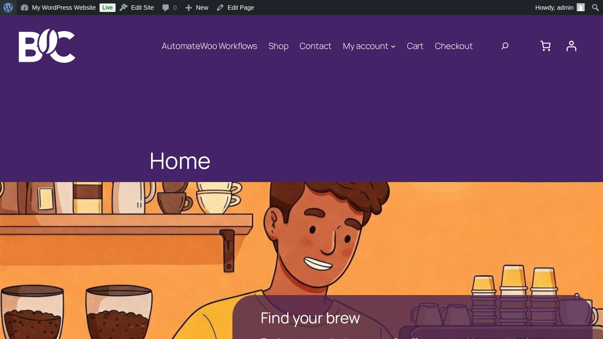

 

<h2><strong>Feed Reader with the Friends Plugin</strong></h2>

By using the Friends plugin, you can read feeds from the web in Playground, and even via ActivityPub

<small>By <a href="https://github.com/akirk">@akirk</a> • <a href="https://github.com/wordpress/blueprints/blob/trunk/blueprints/friends-cors/blueprint.json">View source</a> • <a href="https://playground.wordpress.net/builder/builder.html?blueprint-url=https://raw.githubusercontent.com/wordpress/blueprints/d17b1bb6a5f6b2b3293625804a4f2a73284052f3/blueprints/friends-cors/blueprint.json">Edit</a></small>

 

<h2><strong>Gaming News</strong></h2>

A gaming news site created with the Spiel theme.

<small>By <a href="https://github.com/WordPress.com">@WordPress.com</a> • <a href="https://github.com/wordpress/blueprints/blob/trunk/blueprints/news-spiel/blueprint.json">View source</a> • <a href="https://playground.wordpress.net/builder/builder.html?blueprint-url=https://raw.githubusercontent.com/wordpress/blueprints/d17b1bb6a5f6b2b3293625804a4f2a73284052f3/blueprints/news-spiel/blueprint.json">Edit</a></small>

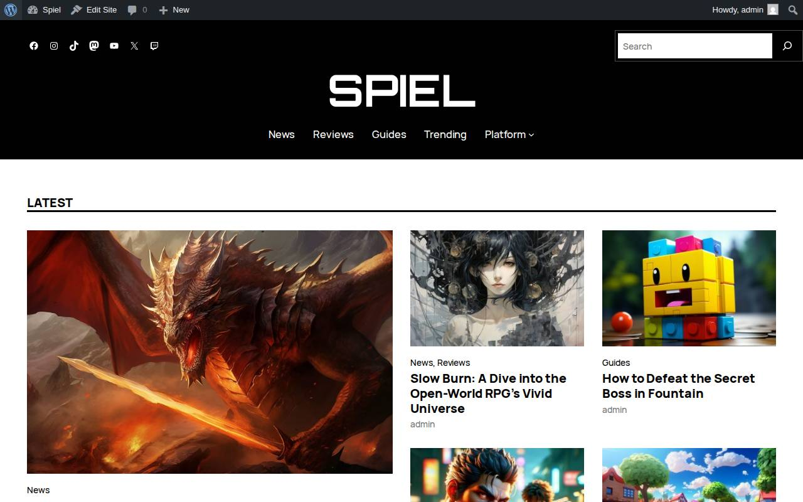

 

<h2><strong>Non-profit Organization</strong></h2>

A non-profit organization site created with the Koinonia theme.

<small>By <a href="https://github.com/WordPress.com">@WordPress.com</a> • <a href="https://github.com/wordpress/blueprints/blob/trunk/blueprints/organization-koinonia/blueprint.json">View source</a> • <a href="https://playground.wordpress.net/builder/builder.html?blueprint-url=https://raw.githubusercontent.com/wordpress/blueprints/d17b1bb6a5f6b2b3293625804a4f2a73284052f3/blueprints/organization-koinonia/blueprint.json">Edit</a></small>

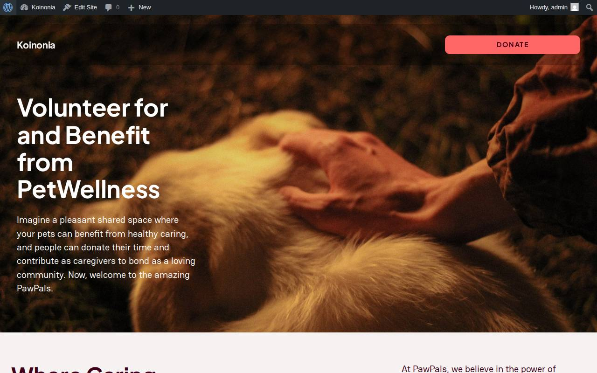

 

<h2><strong>Personal Blog</strong></h2>

A personal blog site created with the Substrata theme.

<small>By <a href="https://github.com/WordPress.com">@WordPress.com</a> • <a href="https://github.com/wordpress/blueprints/blob/trunk/blueprints/personal-substrata/blueprint.json">View source</a> • <a href="https://playground.wordpress.net/builder/builder.html?blueprint-url=https://raw.githubusercontent.com/wordpress/blueprints/d17b1bb6a5f6b2b3293625804a4f2a73284052f3/blueprints/personal-substrata/blueprint.json">Edit</a></small>

 

<h2><strong>Personal Resume</strong></h2>

A resume site created with the Readymade theme.

<small>By <a href="https://github.com/WordPress.com">@WordPress.com</a> • <a href="https://github.com/wordpress/blueprints/blob/trunk/blueprints/personal-readymade/blueprint.json">View source</a> • <a href="https://playground.wordpress.net/builder/builder.html?blueprint-url=https://raw.githubusercontent.com/wordpress/blueprints/d17b1bb6a5f6b2b3293625804a4f2a73284052f3/blueprints/personal-readymade/blueprint.json">Edit</a></small>

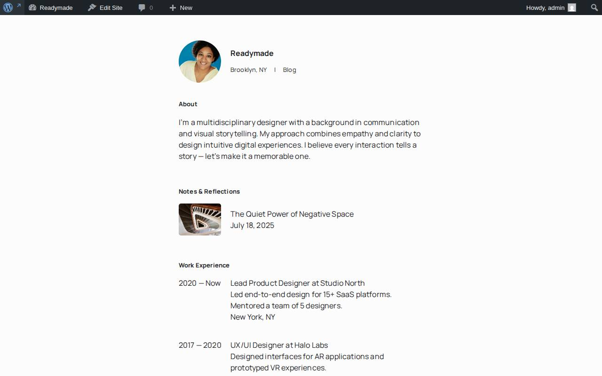

 

<h2><strong>Photography Portfolio</strong></h2>

A photography portfolio created with the Grammer theme.

<small>By <a href="https://github.com/WordPress.com">@WordPress.com</a> • <a href="https://github.com/wordpress/blueprints/blob/trunk/blueprints/portfolio-grammer/blueprint.json">View source</a> • <a href="https://playground.wordpress.net/builder/builder.html?blueprint-url=https://raw.githubusercontent.com/wordpress/blueprints/d17b1bb6a5f6b2b3293625804a4f2a73284052f3/blueprints/portfolio-grammer/blueprint.json">Edit</a></small>

 

<h2><strong>Skincare Blog</strong></h2>

A skincare blog created with the Piel theme.

<small>By <a href="https://github.com/WordPress.com">@WordPress.com</a> • <a href="https://github.com/wordpress/blueprints/blob/trunk/blueprints/news-piel/blueprint.json">View source</a> • <a href="https://playground.wordpress.net/builder/builder.html?blueprint-url=https://raw.githubusercontent.com/wordpress/blueprints/d17b1bb6a5f6b2b3293625804a4f2a73284052f3/blueprints/news-piel/blueprint.json">Edit</a></small>

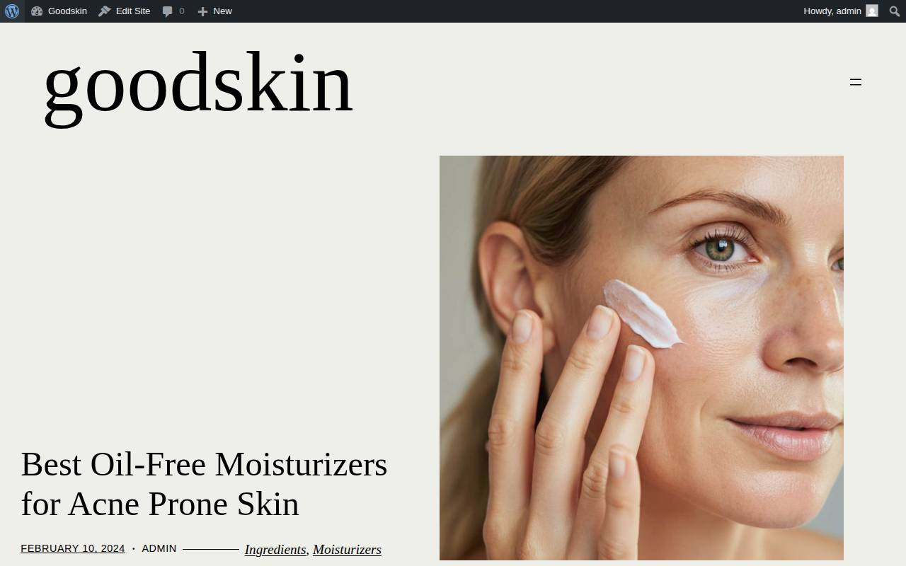

 

<h2><strong>University Website</strong></h2>

A university website created with the Kentwood theme.

<small>By <a href="https://github.com/WordPress.com">@WordPress.com</a> • <a href="https://github.com/wordpress/blueprints/blob/trunk/blueprints/organization-kentwood/blueprint.json">View source</a> • <a href="https://playground.wordpress.net/builder/builder.html?blueprint-url=https://raw.githubusercontent.com/wordpress/blueprints/d17b1bb6a5f6b2b3293625804a4f2a73284052f3/blueprints/organization-kentwood/blueprint.json">Edit</a></small>

 

<h2>AI Assistant</h2>

AI-powered chat interface to modify your WordPress to your liking. Bring your own key or use a local LLM

<small>By <a href="https://github.com/Alex Kirk">@Alex Kirk</a> • <a href="https://github.com/wordpress/blueprints/blob/trunk/blueprints/ai-assistant/blueprint.json">View source</a> • <a href="https://playground.wordpress.net/builder/builder.html?blueprint-url=https://raw.githubusercontent.com/wordpress/blueprints/c436e943e3fe4a408e8a64375397f5173941a467/blueprints/ai-assistant/blueprint.json">Edit</a></small>

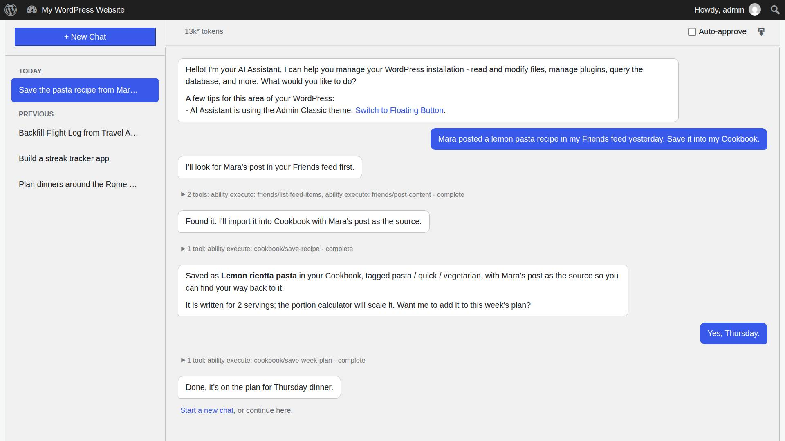

 

<h2>Apiary Press</h2>

Track beehives and record hive visits.

<small>By <a href="https://github.com/Francesco Bigiarini">@Francesco Bigiarini</a> • <a href="https://github.com/wordpress/blueprints/blob/trunk/blueprints/apiary-press/blueprint.json">View source</a> • <a href="https://playground.wordpress.net/builder/builder.html?blueprint-url=https://raw.githubusercontent.com/wordpress/blueprints/39a348963eb1a18f2c34da9622a2c1e15201ddd0/blueprints/apiary-press/blueprint.json">Edit</a></small>

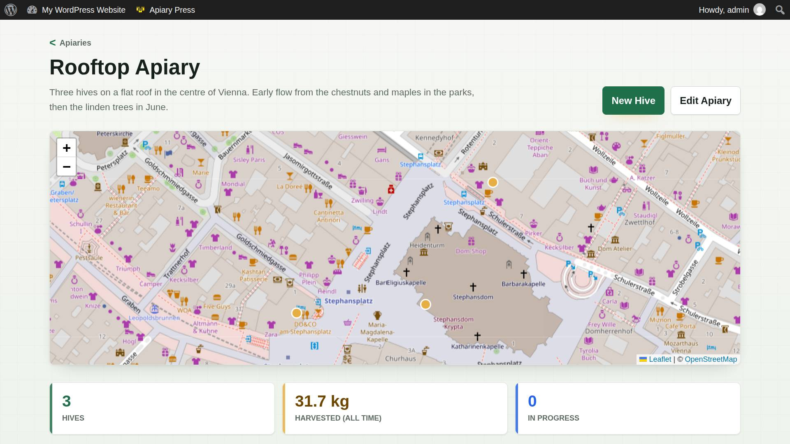

 

<h2>Chat to Blog</h2>

Import media from Beeper chats and create blog posts. Requires Beeper Desktop running.

<small>By <a href="https://github.com/Alex Kirk">@Alex Kirk</a> • <a href="https://github.com/wordpress/blueprints/blob/trunk/blueprints/chat-to-blog/blueprint.json">View source</a> • <a href="https://playground.wordpress.net/builder/builder.html?blueprint-url=https://raw.githubusercontent.com/wordpress/blueprints/26507076d7a5042627d039fc2a10af8332295413/blueprints/chat-to-blog/blueprint.json">Edit</a></small>

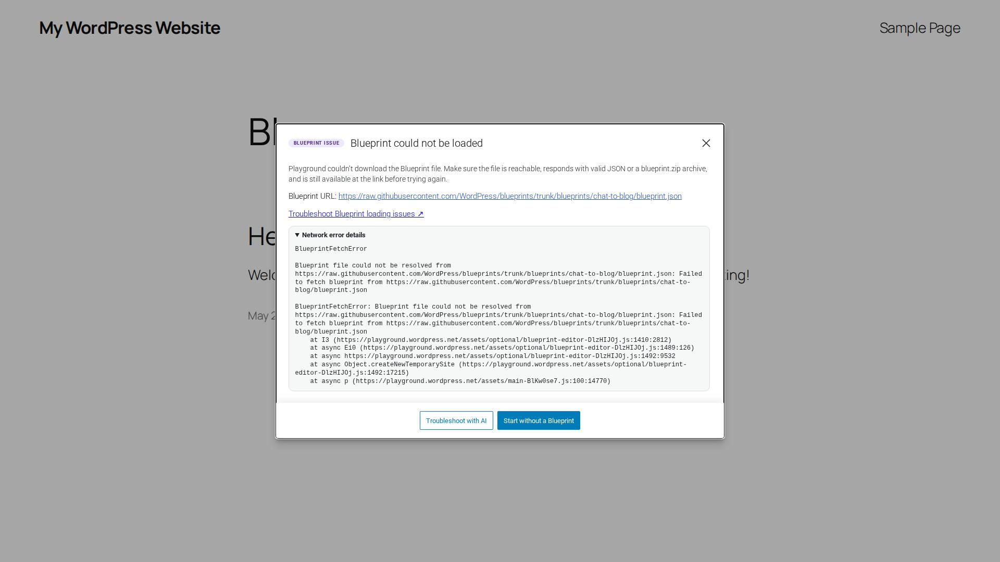

 

<h2>Collect Posts from the Web</h2>

Use the Post Collection Plugin to save articles from around the web

<small>By <a href="https://github.com/Alex Kirk">@Alex Kirk</a> • <a href="https://github.com/wordpress/blueprints/blob/trunk/blueprints/post-collection/blueprint.json">View source</a> • <a href="https://playground.wordpress.net/builder/builder.html?blueprint-url=https://raw.githubusercontent.com/wordpress/blueprints/e2c00fbaedfa72a344457eac1c548b8cef91ff50/blueprints/post-collection/blueprint.json">Edit</a></small>

 

<h2>Cookbook</h2>

Store your recipes in your WordPress, with ingredients, steps, and prep/cook times. Paste a URL to pull a recipe in from the web.

<small>By <a href="https://github.com/Alex Kirk">@Alex Kirk</a> • <a href="https://github.com/wordpress/blueprints/blob/trunk/blueprints/cookbook/blueprint.json">View source</a> • <a href="https://playground.wordpress.net/builder/builder.html?blueprint-url=https://raw.githubusercontent.com/wordpress/blueprints/26507076d7a5042627d039fc2a10af8332295413/blueprints/cookbook/blueprint.json">Edit</a></small>

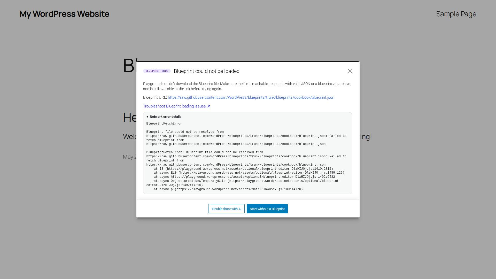

 

<h2>Create Block Theme</h2>

Blueprint to install Create Block Theme and start editing right away

<small>By <a href="https://github.com/jonathanbossenger">@jonathanbossenger</a> • <a href="https://github.com/wordpress/blueprints/blob/trunk/blueprints/create-block-theme/blueprint.json">View source</a> • <a href="https://playground.wordpress.net/builder/builder.html?blueprint-url=https://raw.githubusercontent.com/wordpress/blueprints/d17b1bb6a5f6b2b3293625804a4f2a73284052f3/blueprints/create-block-theme/blueprint.json">Edit</a></small>

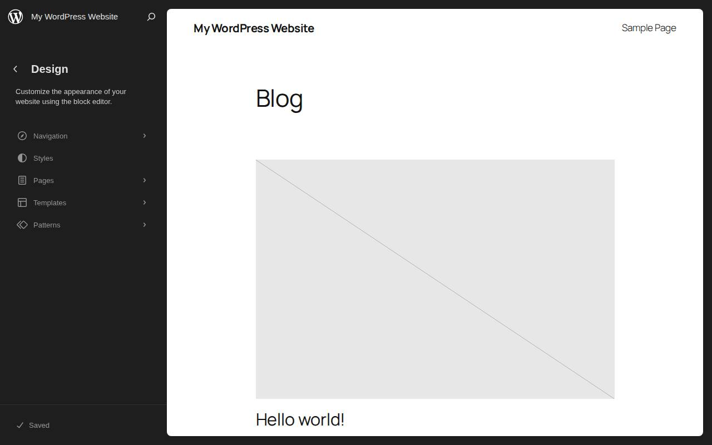

 

<h2>Creating a new user for the blog</h2>

This is a simple example to update user meta data

<small>By <a href="https://github.com/fellyph">@fellyph</a> • <a href="https://github.com/wordpress/blueprints/blob/trunk/blueprints/user-meta/blueprint.json">View source</a> • <a href="https://playground.wordpress.net/builder/builder.html?blueprint-url=https://raw.githubusercontent.com/wordpress/blueprints/d17b1bb6a5f6b2b3293625804a4f2a73284052f3/blueprints/user-meta/blueprint.json">Edit</a></small>

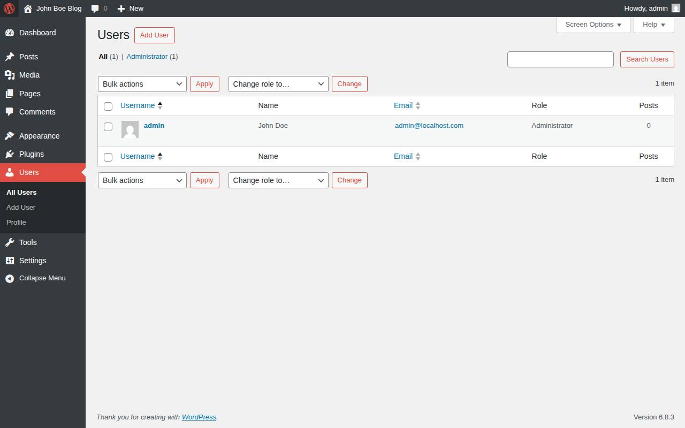

 

<h2>Custom Post Type: Books</h2>

Blueprint that added a custom post type to playground

<small>By <a href="https://github.com/bph">@bph</a> • <a href="https://github.com/wordpress/blueprints/blob/trunk/blueprints/custom-post/blueprint.json">View source</a> • <a href="https://playground.wordpress.net/builder/builder.html?blueprint-url=https://raw.githubusercontent.com/wordpress/blueprints/d17b1bb6a5f6b2b3293625804a4f2a73284052f3/blueprints/custom-post/blueprint.json">Edit</a></small>

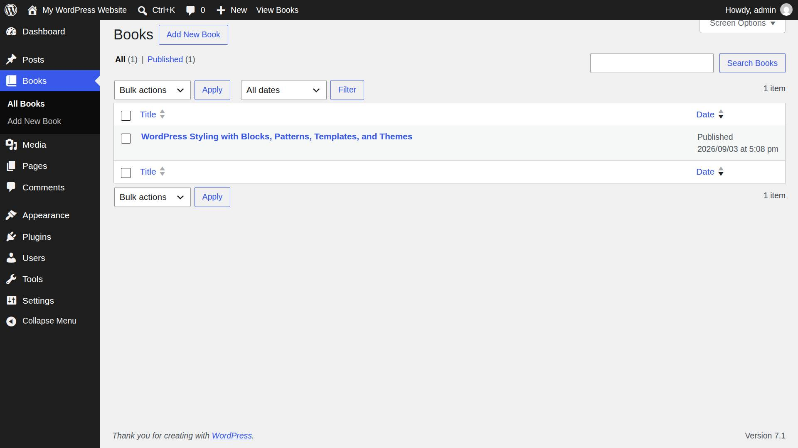

 

<h2>Demo of Twenty-Twenty-Five theme</h2>

Blueprint with demo content for the Twenty-Twenty-Five default theme

<small>By <a href="https://github.com/bph">@bph</a> • <a href="https://github.com/wordpress/blueprints/blob/trunk/blueprints/tt5-demo/blueprint.json">View source</a> • <a href="https://playground.wordpress.net/builder/builder.html?blueprint-url=https://raw.githubusercontent.com/wordpress/blueprints/d17b1bb6a5f6b2b3293625804a4f2a73284052f3/blueprints/tt5-demo/blueprint.json">Edit</a></small>

 

<h2>Display Admin Notice</h2>

Blueprint to add a tiny mu-plugin and display an admin notice

<small>By <a href="https://github.com/bph">@bph</a> • <a href="https://github.com/wordpress/blueprints/blob/trunk/blueprints/admin-notice/blueprint.json">View source</a> • <a href="https://playground.wordpress.net/builder/builder.html?blueprint-url=https://raw.githubusercontent.com/wordpress/blueprints/d17b1bb6a5f6b2b3293625804a4f2a73284052f3/blueprints/admin-notice/blueprint.json">Edit</a></small>

 

<h2>Enable all three Dataview Experiments in Gutenberg</h2>

Blueprint example to enable multiple Experiments within the Gutenberg plugin 

<small>By <a href="https://github.com/bph">@bph</a> • <a href="https://github.com/wordpress/blueprints/blob/trunk/blueprints/gb-more-experiments/blueprint.json">View source</a> • <a href="https://playground.wordpress.net/builder/builder.html?blueprint-url=https://raw.githubusercontent.com/wordpress/blueprints/d17b1bb6a5f6b2b3293625804a4f2a73284052f3/blueprints/gb-more-experiments/blueprint.json">Edit</a></small>

 

<h2>Fancy Dashboard Widget</h2>

A blueprint to display statistics about users, posts and comments on a WordPress site.

<small>By <a href="https://github.com/muryamsultana">@muryamsultana</a> • <a href="https://github.com/wordpress/blueprints/blob/trunk/blueprints/fancy-dashboard_widget/blueprint.json">View source</a> • <a href="https://playground.wordpress.net/builder/builder.html?blueprint-url=https://raw.githubusercontent.com/wordpress/blueprints/d17b1bb6a5f6b2b3293625804a4f2a73284052f3/blueprints/fancy-dashboard_widget/blueprint.json">Edit</a></small>

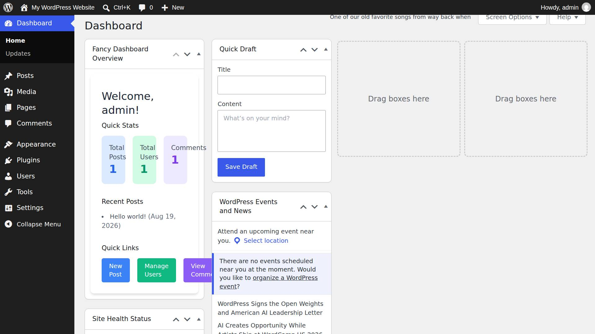

 

<h2>Flight Log</h2>

A private flight log and statistics app for WordPress.

<small>By <a href="https://github.com/Alex Kirk">@Alex Kirk</a> • <a href="https://github.com/wordpress/blueprints/blob/trunk/blueprints/flight-log/blueprint.json">View source</a> • <a href="https://playground.wordpress.net/builder/builder.html?blueprint-url=https://raw.githubusercontent.com/wordpress/blueprints/ef925bd54c647b60e5ed0cfa11b5a3d87d55a52d/blueprints/flight-log/blueprint.json">Edit</a></small>

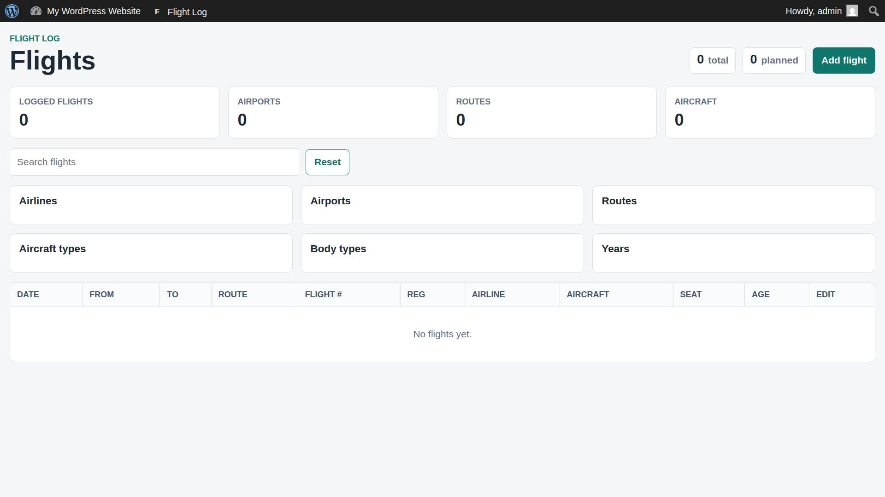

 

<h2>Grid Variations Experiments enabled</h2>

Blueprint example to toggle on enable a feature from the Experiments page in Gutenberg plugin

<small>By <a href="https://github.com/bph">@bph</a> • <a href="https://github.com/wordpress/blueprints/blob/trunk/blueprints/grid-variations/blueprint.json">View source</a> • <a href="https://playground.wordpress.net/builder/builder.html?blueprint-url=https://raw.githubusercontent.com/wordpress/blueprints/d17b1bb6a5f6b2b3293625804a4f2a73284052f3/blueprints/grid-variations/blueprint.json">Edit</a></small>

 

<h2>Gutenberg Guidelines Experiment enabled</h2>

Enables the Gutenberg Guidelines experiment from the Gutenberg Experiments page

<small>By <a href="https://github.com/smithjw1">@smithjw1</a> • <a href="https://github.com/wordpress/blueprints/blob/trunk/blueprints/gutenberg-guidelines/blueprint.json">View source</a> • <a href="https://playground.wordpress.net/builder/builder.html?blueprint-url=https://raw.githubusercontent.com/wordpress/blueprints/7edc4beec9a05bd41b13bc377aa6f6be6fed1552/blueprints/gutenberg-guidelines/blueprint.json">Edit</a></small>

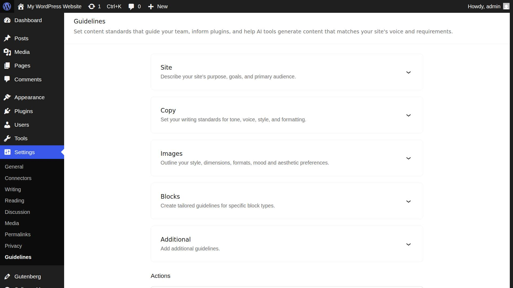

 

<h2>Import Theme Starter Content</h2>

Blueprint to install a theme with starter content, (here: Twenty-Twenty-One)

<small>By <a href="https://github.com/bph">@bph</a> • <a href="https://github.com/wordpress/blueprints/blob/trunk/blueprints/theme-starter-content/blueprint.json">View source</a> • <a href="https://playground.wordpress.net/builder/builder.html?blueprint-url=https://raw.githubusercontent.com/wordpress/blueprints/d17b1bb6a5f6b2b3293625804a4f2a73284052f3/blueprints/theme-starter-content/blueprint.json">Edit</a></small>

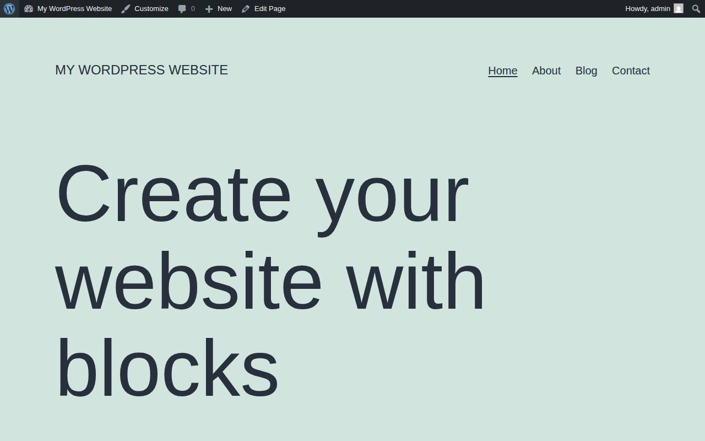

 

<h2>Import a standalone starter content via a blueprint step</h2>

Blueprint to use a stand-alone starter content file and then to import it. Click on 'Subscriptions'

<small>By <a href="https://github.com/bph">@bph</a> • <a href="https://github.com/wordpress/blueprints/blob/trunk/blueprints/file-starter-content/blueprint.json">View source</a> • <a href="https://playground.wordpress.net/builder/builder.html?blueprint-url=https://raw.githubusercontent.com/wordpress/blueprints/d17b1bb6a5f6b2b3293625804a4f2a73284052f3/blueprints/file-starter-content/blueprint.json">Edit</a></small>

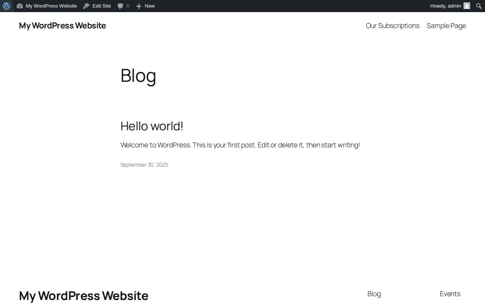

 

<h2>Install WordPress language packs</h2>

Installs and activates the latest WordPress Japanese translation pack from https://translate.wordpress.org/ – both for WordPress core and for the friends plugin.

<small>By <a href="https://github.com/adamziel">@adamziel</a> • <a href="https://github.com/wordpress/blueprints/blob/trunk/blueprints/translations/blueprint.json">View source</a> • <a href="https://playground.wordpress.net/builder/builder.html?blueprint-url=https://raw.githubusercontent.com/wordpress/blueprints/d17b1bb6a5f6b2b3293625804a4f2a73284052f3/blueprints/translations/blueprint.json">Edit</a></small>

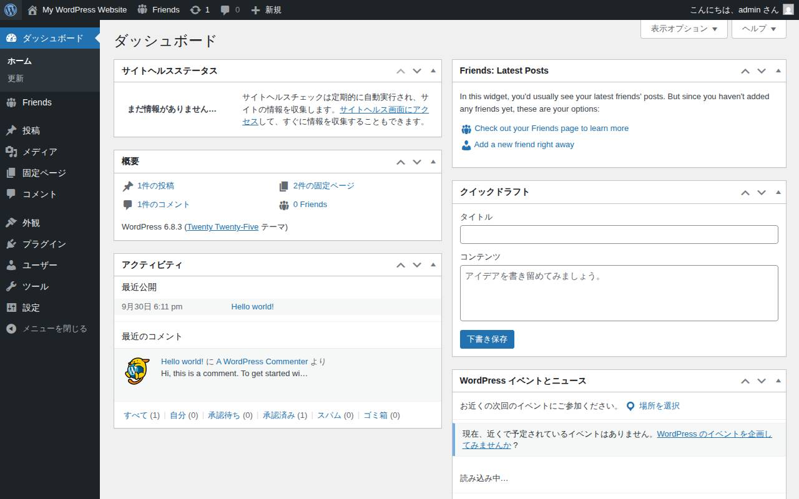

 

<h2>Install plugin from a gist</h2>

Install and activate a WordPress plugin from a .php file stored in a gist.

<small>By <a href="https://github.com/zieladam">@zieladam</a> • <a href="https://github.com/wordpress/blueprints/blob/trunk/blueprints/install-plugin-from-gist/blueprint.json">View source</a> • <a href="https://playground.wordpress.net/builder/builder.html?blueprint-url=https://raw.githubusercontent.com/wordpress/blueprints/d17b1bb6a5f6b2b3293625804a4f2a73284052f3/blueprints/install-plugin-from-gist/blueprint.json">Edit</a></small>

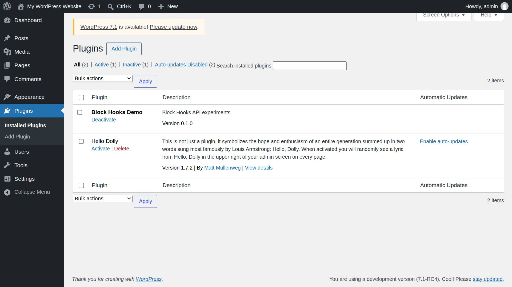

 

<h2>Latest Gutenberg plugin</h2>

A preview of the latest version of the Gutenberg plugin.

<small>By <a href="https://github.com/zieladam">@zieladam</a> • <a href="https://github.com/wordpress/blueprints/blob/trunk/blueprints/latest-gutenberg/blueprint.json">View source</a> • <a href="https://playground.wordpress.net/builder/builder.html?blueprint-url=https://raw.githubusercontent.com/wordpress/blueprints/d17b1bb6a5f6b2b3293625804a4f2a73284052f3/blueprints/latest-gutenberg/blueprint.json">Edit</a></small>

 

<h2>Learn WordPress</h2>

A personal study helper for Learn WordPress courses with course plans, lesson checklists, dates, and progress tracking.

<small>By <a href="https://github.com/WordPress">@WordPress</a> • <a href="https://github.com/wordpress/blueprints/blob/trunk/blueprints/learn-app/blueprint.json">View source</a> • <a href="https://playground.wordpress.net/builder/builder.html?blueprint-url=https://raw.githubusercontent.com/wordpress/blueprints/e2c00fbaedfa72a344457eac1c548b8cef91ff50/blueprints/learn-app/blueprint.json">Edit</a></small>

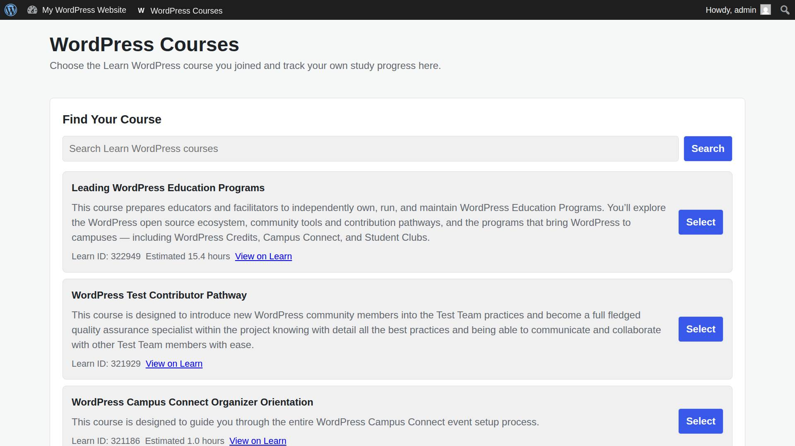

 

<h2>Loading, activating, and configuring a theme from a GitHub repository.</h2>

This is a good example of typical steps used on a theme's loading, activation and configuration

<small>By <a href="https://github.com/richtabor">@richtabor</a> • <a href="https://github.com/wordpress/blueprints/blob/trunk/blueprints/install-activate-setup-theme-from-gh-repo/blueprint.json">View source</a> • <a href="https://playground.wordpress.net/builder/builder.html?blueprint-url=https://raw.githubusercontent.com/wordpress/blueprints/6697215b708d80382aa04fef6598f217a6db8bee/blueprints/install-activate-setup-theme-from-gh-repo/blueprint.json">Edit</a></small>

 

<h2>Login as an editor</h2>

Test WordPress functionality as an editor rather than an administrator.

<small>By <a href="https://github.com/bacoords">@bacoords</a> • <a href="https://github.com/wordpress/blueprints/blob/trunk/blueprints/login-as-editor/blueprint.json">View source</a> • <a href="https://playground.wordpress.net/builder/builder.html?blueprint-url=https://raw.githubusercontent.com/wordpress/blueprints/d17b1bb6a5f6b2b3293625804a4f2a73284052f3/blueprints/login-as-editor/blueprint.json">Edit</a></small>

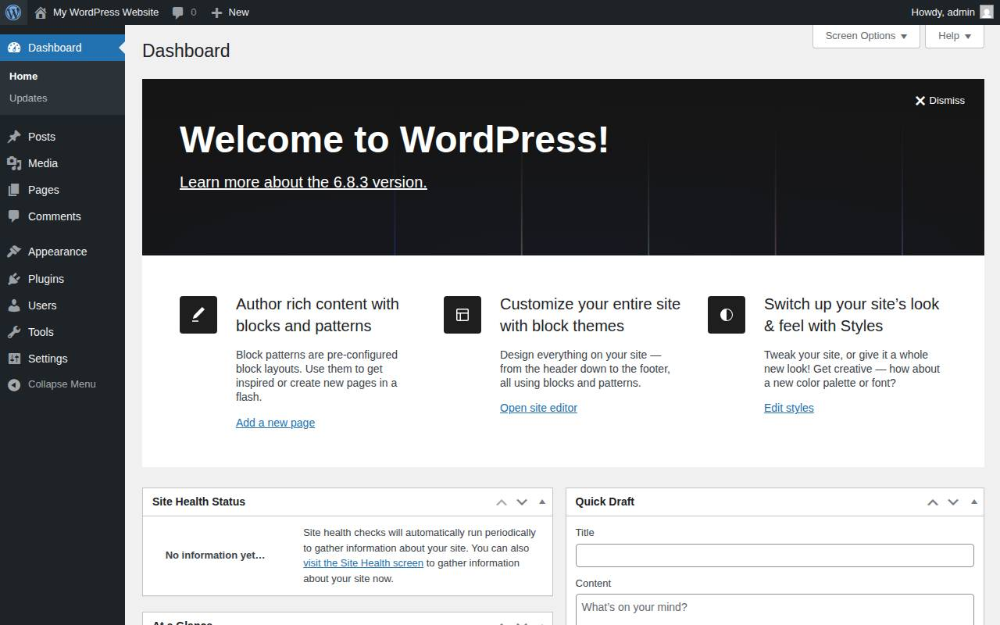

 

<h2>Markdown and Trac Syntax Editor</h2>

Edit Markdown and Trac formatting in the block editor thanks to the blocky-formats plugin!

<small>By <a href="https://github.com/adamziel">@adamziel</a> • <a href="https://github.com/wordpress/blueprints/blob/trunk/blueprints/blocky-formats/blueprint.json">View source</a> • <a href="https://playground.wordpress.net/builder/builder.html?blueprint-url=https://raw.githubusercontent.com/wordpress/blueprints/d17b1bb6a5f6b2b3293625804a4f2a73284052f3/blueprints/blocky-formats/blueprint.json">Edit</a></small>

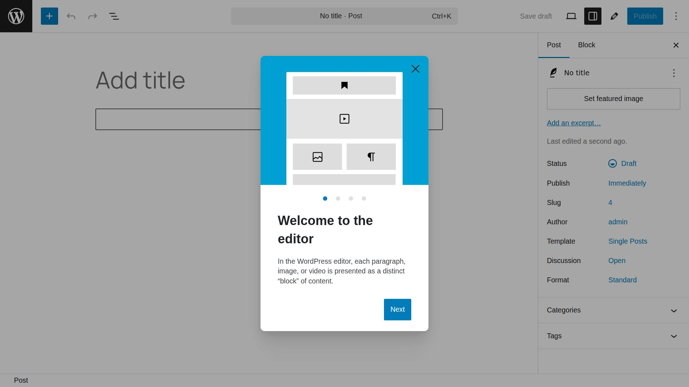

 

<h2>Memex</h2>

Turn WordPress into a note-taking app with bi-directional links, automatic backlinks, daily notes, tags, and reminders. Import notes from Obsidian, Notion, Evernote, or Roam Research with one click.

<small>By <a href="https://github.com/Alex Kirk">@Alex Kirk</a> • <a href="https://github.com/wordpress/blueprints/blob/trunk/blueprints/memex/blueprint.json">View source</a> • <a href="https://playground.wordpress.net/builder/builder.html?blueprint-url=https://raw.githubusercontent.com/wordpress/blueprints/26507076d7a5042627d039fc2a10af8332295413/blueprints/memex/blueprint.json">Edit</a></small>

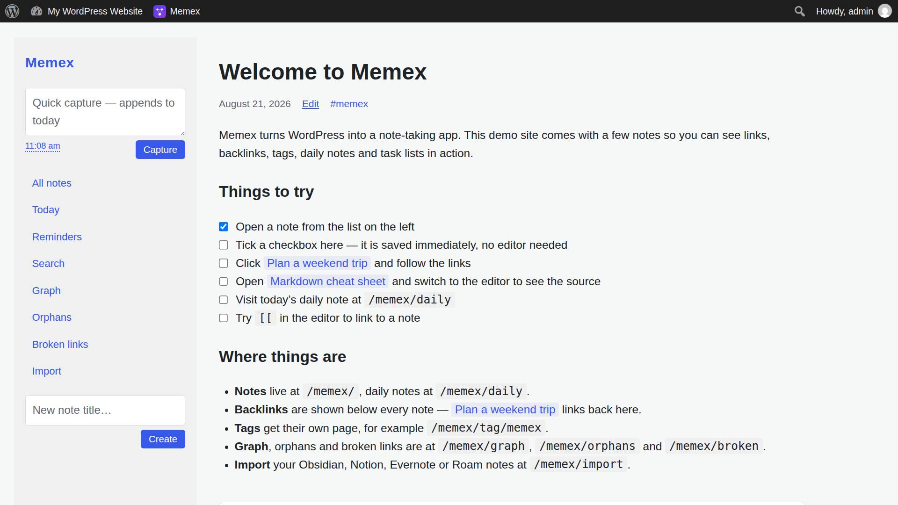

 

<h2>Minimal WooCommerce Setup with Sample Products, Shipping, and Payment Method</h2>

To create a WordPress Playground instance that installs WooCommerce, adds a custom flat rate shipping method via a plugin, imports WooCommerce sample products XML to demonstrate the shipping method on the cart/checkout pages, and enables the Direct Bank Transfer payment method.

<small>By <a href="https://github.com/calvinrodrigues500">@calvinrodrigues500</a> • <a href="https://github.com/wordpress/blueprints/blob/trunk/blueprints/woo-shipping/blueprint.json">View source</a> • <a href="https://playground.wordpress.net/builder/builder.html?blueprint-url=https://raw.githubusercontent.com/wordpress/blueprints/d17b1bb6a5f6b2b3293625804a4f2a73284052f3/blueprints/woo-shipping/blueprint.json">Edit</a></small>

 

<h2>My WordPress</h2>

A welcome experience for persistent WordPress Playground instances. Lets you personalize your site name and optionally import content from an RSS feed.

<small>By <a href="https://github.com/Alex Kirk">@Alex Kirk</a> • <a href="https://github.com/wordpress/blueprints/blob/trunk/blueprints/my-wordpress/blueprint.json">View source</a> • <a href="https://playground.wordpress.net/builder/builder.html?blueprint-url=https://raw.githubusercontent.com/wordpress/blueprints/a46112c154bb204f52ffe5873bcc41d0dadf69fa/blueprints/my-wordpress/blueprint.json">Edit</a></small>

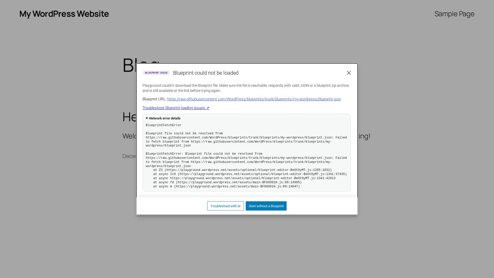

 

<h2>Personal CRM</h2>

Manage your contacts and relationships directly from WordPress

<small>By <a href="https://github.com/Alex Kirk">@Alex Kirk</a> • <a href="https://github.com/wordpress/blueprints/blob/trunk/blueprints/personal-crm/blueprint.json">View source</a> • <a href="https://playground.wordpress.net/builder/builder.html?blueprint-url=https://raw.githubusercontent.com/wordpress/blueprints/33d0f14c1c330d5e9571081fc160b39362204117/blueprints/personal-crm/blueprint.json">Edit</a></small>

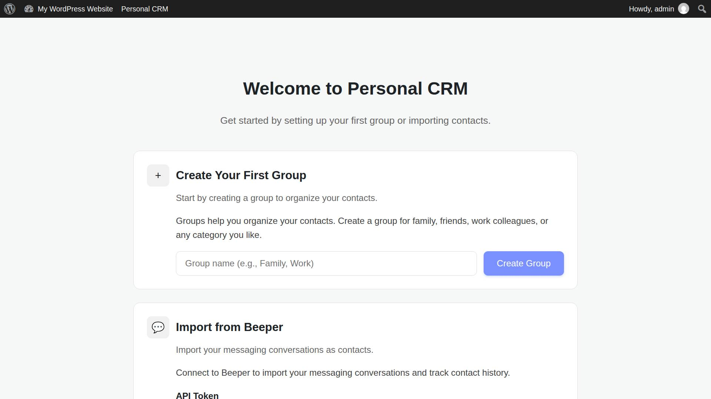

 

<h2>Playground Builder</h2>

Compose WordPress Playground blueprints from plugins, themes, versions, language settings, and launch URLs.

<small>By <a href="https://github.com/Alex Kirk">@Alex Kirk</a> • <a href="https://github.com/wordpress/blueprints/blob/trunk/blueprints/playground-builder/blueprint.json">View source</a> • <a href="https://playground.wordpress.net/builder/builder.html?blueprint-url=https://raw.githubusercontent.com/wordpress/blueprints/1357ad4e63bc52487d3a70ad4a13d4a07420d8b8/blueprints/playground-builder/blueprint.json">Edit</a></small>

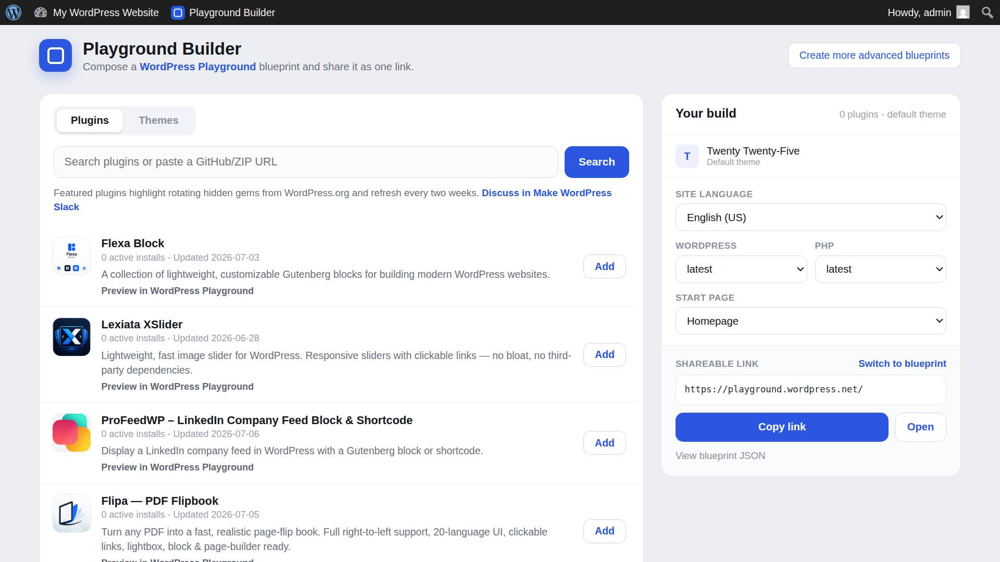

 

<h2>Playground Welcome Landing Page</h2>

Landing page for the WordPress Playground giving a quick overview of the features and capabilities of the platform.

<small>By <a href="https://github.com/fellyph">@fellyph</a> • <a href="https://github.com/wordpress/blueprints/blob/trunk/blueprints/welcome/blueprint.json">View source</a> • <a href="https://playground.wordpress.net/builder/builder.html?blueprint-url=https://raw.githubusercontent.com/wordpress/blueprints/54cdbaa2a903a7cd5c4a4785122798f23173b719/blueprints/welcome/blueprint.json">Edit</a></small>

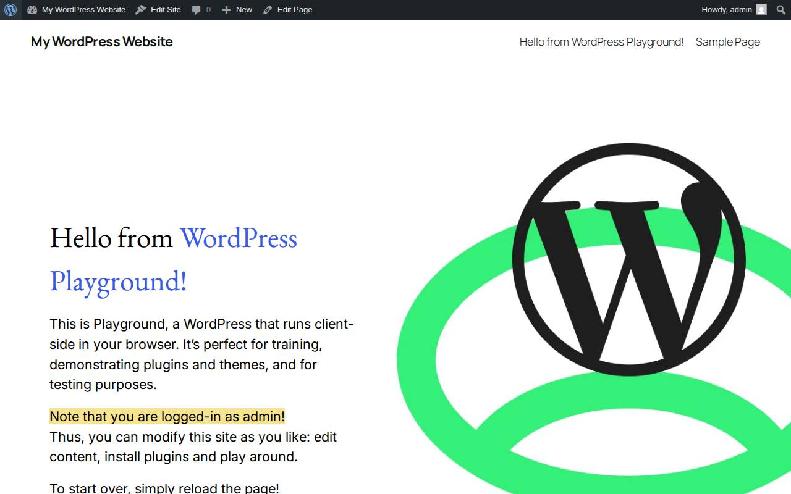

 

<h2>Pretty permalinks</h2>

Set the permalink structure to use pretty permalinks.

<small>By <a href="https://github.com/bgrgicak">@bgrgicak</a> • <a href="https://github.com/wordpress/blueprints/blob/trunk/blueprints/use-pretty-permalinks/blueprint.json">View source</a> • <a href="https://playground.wordpress.net/builder/builder.html?blueprint-url=https://raw.githubusercontent.com/wordpress/blueprints/d17b1bb6a5f6b2b3293625804a4f2a73284052f3/blueprints/use-pretty-permalinks/blueprint.json">Edit</a></small>

 

<h2>RSS Reader</h2>

Follow friends and consume their content in your WordPress

<small>By <a href="https://github.com/Alex Kirk">@Alex Kirk</a> • <a href="https://github.com/wordpress/blueprints/blob/trunk/blueprints/rss-reader/blueprint.json">View source</a> • <a href="https://playground.wordpress.net/builder/builder.html?blueprint-url=https://raw.githubusercontent.com/wordpress/blueprints/33d0f14c1c330d5e9571081fc160b39362204117/blueprints/rss-reader/blueprint.json">Edit</a></small>

 

<h2>Reset data and import content (with logs)</h2>

It resets default data before importing custom content. It also logs the state of the content after each step.

<small>By <a href="https://github.com/juanmaguitar">@juanmaguitar</a> • <a href="https://github.com/wordpress/blueprints/blob/trunk/blueprints/reset-data-and-import-content/blueprint.json">View source</a> • <a href="https://playground.wordpress.net/builder/builder.html?blueprint-url=https://raw.githubusercontent.com/wordpress/blueprints/d17b1bb6a5f6b2b3293625804a4f2a73284052f3/blueprints/reset-data-and-import-content/blueprint.json">Edit</a></small>

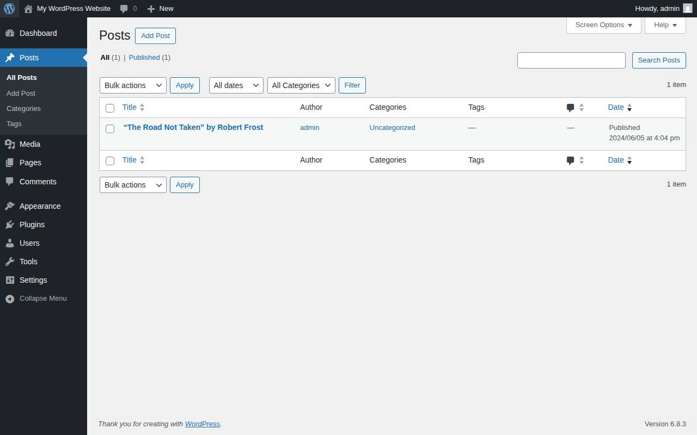

 

<h2>Serve media files from another host</h2>

Redirect any requests to files within the uploads directory to an external host. This is useful when you have a lot of image attachments in your playground but don’t want to include them all in the blueprint.

<small>By <a href="https://github.com/ivanblagdan">@ivanblagdan</a> • <a href="https://github.com/wordpress/blueprints/blob/trunk/blueprints/redirect-upload-requests/blueprint.json">View source</a> • <a href="https://playground.wordpress.net/builder/builder.html?blueprint-url=https://raw.githubusercontent.com/wordpress/blueprints/d17b1bb6a5f6b2b3293625804a4f2a73284052f3/blueprints/redirect-upload-requests/blueprint.json">Edit</a></small>

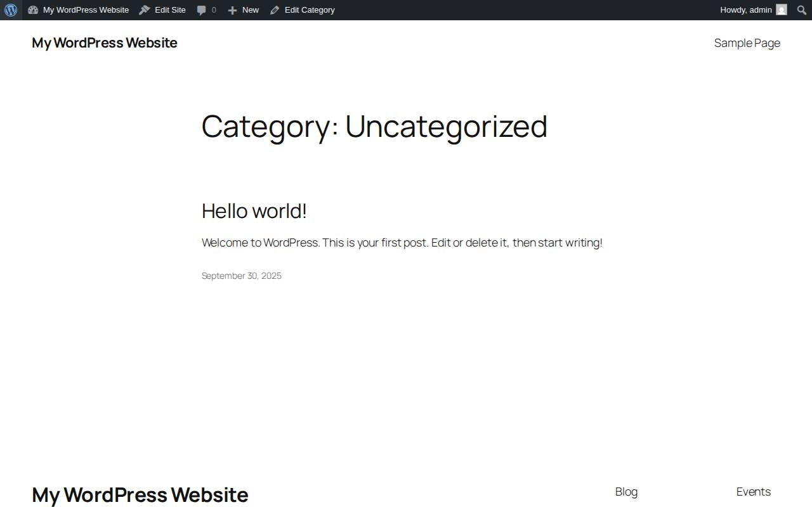

 

<h2>Set the admin color scheme</h2>

Set the admin color scheme to Modern using the updateUserMeta step.

<small>By <a href="https://github.com/ndiego">@ndiego</a> • <a href="https://github.com/wordpress/blueprints/blob/trunk/blueprints/set-admin-color-scheme/blueprint.json">View source</a> • <a href="https://playground.wordpress.net/builder/builder.html?blueprint-url=https://raw.githubusercontent.com/wordpress/blueprints/d17b1bb6a5f6b2b3293625804a4f2a73284052f3/blueprints/set-admin-color-scheme/blueprint.json">Edit</a></small>

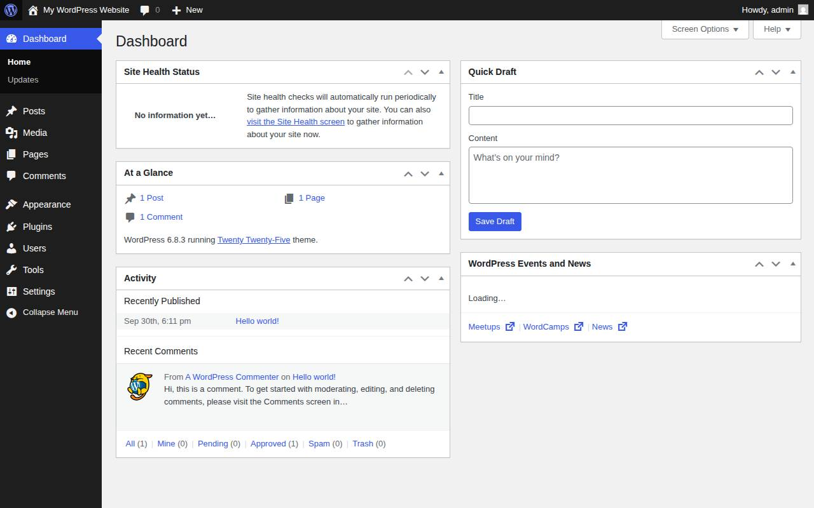

 

<h2>Showcase plugin</h2>

Showcase custom plugin from own server with media files and content imported as WXR. There is a readme file in github repository (https://github.com/Lovor01/blueprints/blob/trunk/blueprints/showcase-plugin-with-media/readme.md) which explains all steps.

<small>By <a href="https://github.com/Lovor01">@Lovor01</a> • <a href="https://github.com/wordpress/blueprints/blob/trunk/blueprints/showcase-plugin-with-media/blueprint.json">View source</a> • <a href="https://playground.wordpress.net/builder/builder.html?blueprint-url=https://raw.githubusercontent.com/wordpress/blueprints/6393b4974e88ce09d0253068d8fcf0eacbc3ff9a/blueprints/showcase-plugin-with-media/blueprint.json">Edit</a></small>

 

<h2>Stylish Press</h2>

A Woo store with custom theme, content, and products.

<small>By <a href="https://github.com/adamziel">@adamziel</a> • <a href="https://github.com/wordpress/blueprints/blob/trunk/blueprints/stylish-press/blueprint.json">View source</a> • <a href="https://playground.wordpress.net/builder/builder.html?blueprint-url=https://raw.githubusercontent.com/wordpress/blueprints/6393b4974e88ce09d0253068d8fcf0eacbc3ff9a/blueprints/stylish-press/blueprint.json">Edit</a></small>

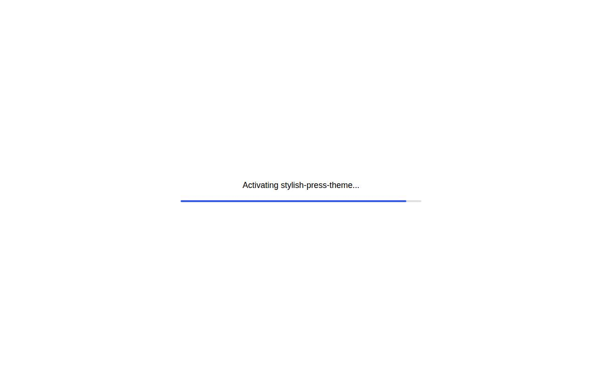

 

<h2>Symfony Package Radar</h2>

A PHP-only Symfony app that demonstrates attribute routing, autowiring, Twig, and HttpClient without downloading WordPress, Node.js, Sass, or an asset build step.

<small>By <a href="https://github.com/adamziel">@adamziel</a> • <a href="https://github.com/wordpress/blueprints/blob/trunk/blueprints/symfony-package-radar/blueprint.json">View source</a> • <a href="https://playground.wordpress.net/builder/builder.html?blueprint-url=https://raw.githubusercontent.com/wordpress/blueprints/eac8ac5407ca1762921c6b6ffa1bff9a1fda1d18/blueprints/symfony-package-radar/blueprint.json">Edit</a></small>

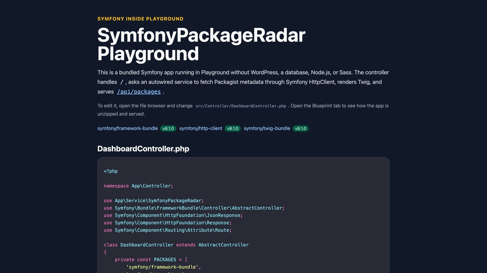

 

<h2>Theme Review Environment</h2>

Helps new theme reviewers get started faster by installing Theme Check and other recommended plugins, enabling WP-CLI, and turning on debug logging.

<small>By <a href="https://github.com/supernovia">@supernovia</a> • <a href="https://github.com/wordpress/blueprints/blob/trunk/blueprints/theme-review-environment/blueprint.json">View source</a> • <a href="https://playground.wordpress.net/builder/builder.html?blueprint-url=https://raw.githubusercontent.com/wordpress/blueprints/3dfa5dbbbe050863c9e97fe3d39668eeac2b8228/blueprints/theme-review-environment/blueprint.json">Edit</a></small>

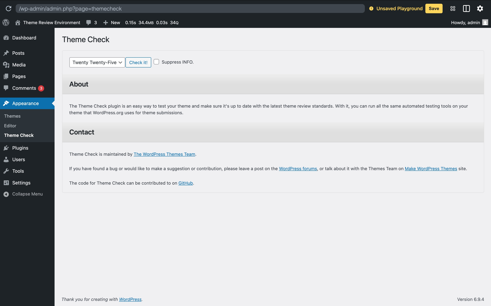

 

<h2>Theme Tester</h2>

Blueprint example to add content and plugins to explore a theme

<small>By <a href="https://github.com/bph">@bph</a> • <a href="https://github.com/wordpress/blueprints/blob/trunk/blueprints/theme-a11y-test/blueprint.json">View source</a> • <a href="https://playground.wordpress.net/builder/builder.html?blueprint-url=https://raw.githubusercontent.com/wordpress/blueprints/d17b1bb6a5f6b2b3293625804a4f2a73284052f3/blueprints/theme-a11y-test/blueprint.json">Edit</a></small>

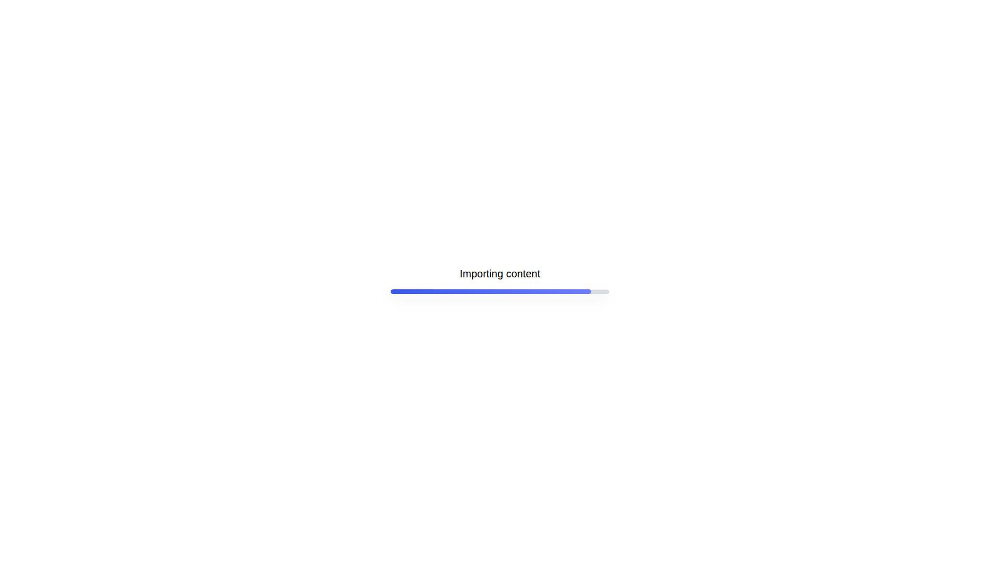

 

<h2>Travel App</h2>

A private travel organizer for WordPress.

<small>By <a href="https://github.com/Alex Kirk">@Alex Kirk</a> • <a href="https://github.com/wordpress/blueprints/blob/trunk/blueprints/travel-app/blueprint.json">View source</a> • <a href="https://playground.wordpress.net/builder/builder.html?blueprint-url=https://raw.githubusercontent.com/wordpress/blueprints/ef925bd54c647b60e5ed0cfa11b5a3d87d55a52d/blueprints/travel-app/blueprint.json">Edit</a></small>

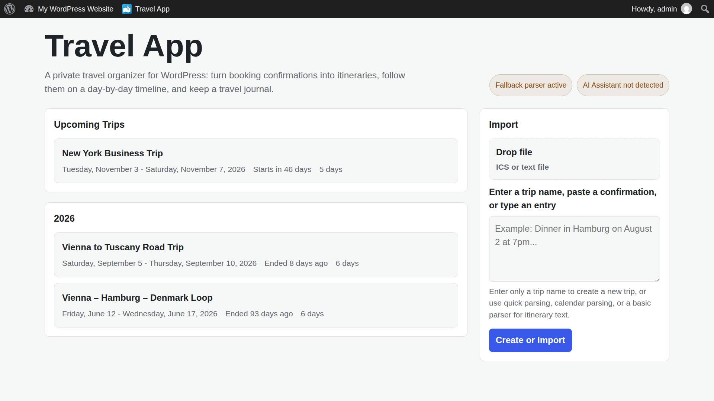

 

<h2>Use WPGraphQL to query WordPress</h2>

Example that loads WordPress with WPGraphQL active and defaults to the WPGraphQL IDE page to allow users to test GraphQL queries and explore the GraphQL Schema.

<small>By <a href="https://github.com/jasonbahl">@jasonbahl</a> • <a href="https://github.com/wordpress/blueprints/blob/trunk/blueprints/wpgraphql/blueprint.json">View source</a> • <a href="https://playground.wordpress.net/builder/builder.html?blueprint-url=https://raw.githubusercontent.com/wordpress/blueprints/d17b1bb6a5f6b2b3293625804a4f2a73284052f3/blueprints/wpgraphql/blueprint.json">Edit</a></small>

 

<h2>Use wp-cli command to add posts</h2>

Blueprint example to add posts via a wp-cli command.

<small>By <a href="https://github.com/bph">@bph</a> • <a href="https://github.com/wordpress/blueprints/blob/trunk/blueprints/posts-via-wp-cli/blueprint.json">View source</a> • <a href="https://playground.wordpress.net/builder/builder.html?blueprint-url=https://raw.githubusercontent.com/wordpress/blueprints/d17b1bb6a5f6b2b3293625804a4f2a73284052f3/blueprints/posts-via-wp-cli/blueprint.json">Edit</a></small>

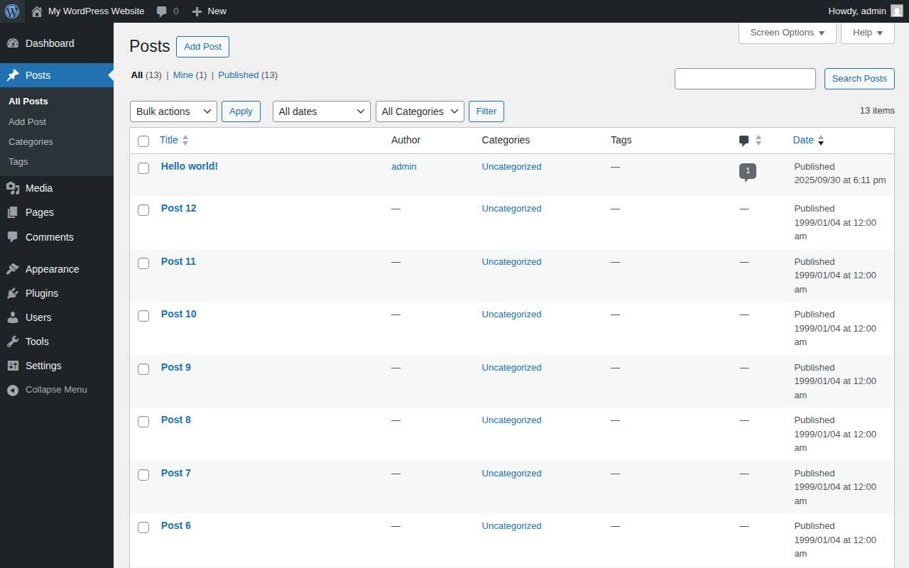

 

<h2>Use wp-cli to add a post with image</h2>

Use wp-cli to create a post from text file with block markup and a featured image

<small>By <a href="https://github.com/bph">@bph</a> • <a href="https://github.com/wordpress/blueprints/blob/trunk/blueprints/wpcli-post-with-image/blueprint.json">View source</a> • <a href="https://playground.wordpress.net/builder/builder.html?blueprint-url=https://raw.githubusercontent.com/wordpress/blueprints/d17b1bb6a5f6b2b3293625804a4f2a73284052f3/blueprints/wpcli-post-with-image/blueprint.json">Edit</a></small>

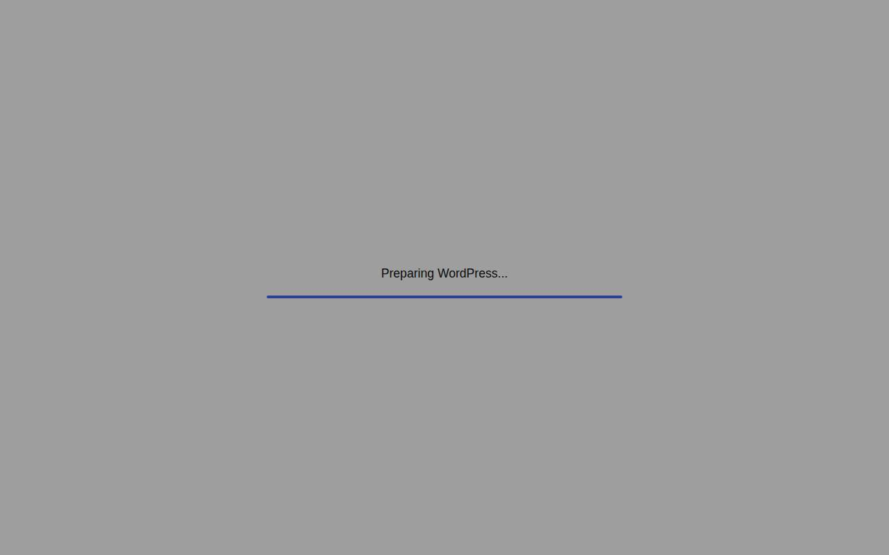

 

<h2>Weather Shortcode Plugin</h2>

A blueprint to connect weather API and show data as shortcode on a WordPress site. Requires your own OpenWeatherMap API key.

<small>By <a href="https://github.com/muryamsultana">@muryamsultana</a> • <a href="https://github.com/wordpress/blueprints/blob/trunk/blueprints/pwa-weather-app/blueprint.json">View source</a> • <a href="https://playground.wordpress.net/builder/builder.html?blueprint-url=https://raw.githubusercontent.com/wordpress/blueprints/1086afa83c533916d03192357658b9a85a3700c1/blueprints/pwa-weather-app/blueprint.json">Edit</a></small>

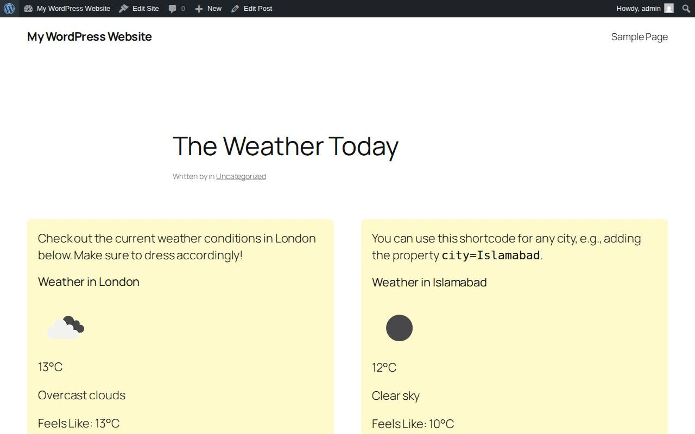

 

<h2>WooCommerce Store (Astra)</h2>

A WooCommerce store with a common configuration: the Astra theme, a set of widely-used extensions, USD / US locale, and sample products. A lifelike environment for testing against WooCommerce.

<small>By <a href="https://github.com/alopezari">@alopezari</a> • <a href="https://github.com/wordpress/blueprints/blob/trunk/blueprints/woocommerce-test-store-astra/blueprint.json">View source</a> • <a href="https://playground.wordpress.net/builder/builder.html?blueprint-url=https://raw.githubusercontent.com/wordpress/blueprints/3e949740af385fdc4dc6b41b0d812cb6aff8fcc7/blueprints/woocommerce-test-store-astra/blueprint.json">Edit</a></small>

<em>No screenshot yet for WooCommerce Store (Astra). Open it in Playground.</em>

 

<h2>WooCommerce Store (Hello Elementor)</h2>

A WooCommerce store with a common configuration: the Hello Elementor theme with Elementor, a set of widely-used extensions, EUR / German locale, and sample products. A lifelike environment for testing against WooCommerce.

<small>By <a href="https://github.com/alopezari">@alopezari</a> • <a href="https://github.com/wordpress/blueprints/blob/trunk/blueprints/woocommerce-test-store-hello-elementor/blueprint.json">View source</a> • <a href="https://playground.wordpress.net/builder/builder.html?blueprint-url=https://raw.githubusercontent.com/wordpress/blueprints/3e949740af385fdc4dc6b41b0d812cb6aff8fcc7/blueprints/woocommerce-test-store-hello-elementor/blueprint.json">Edit</a></small>

<em>No screenshot yet for WooCommerce Store (Hello Elementor). Open it in Playground.</em>

 

<h2>WooCommerce product feed</h2>

Blueprint to create a WooCommerce product and export an XML/CSV product feed

<small>By <a href="https://github.com/mujuonly">@mujuonly</a> • <a href="https://github.com/wordpress/blueprints/blob/trunk/blueprints/woocommerce-product-feed/blueprint.json">View source</a> • <a href="https://playground.wordpress.net/builder/builder.html?blueprint-url=https://raw.githubusercontent.com/wordpress/blueprints/d17b1bb6a5f6b2b3293625804a4f2a73284052f3/blueprints/woocommerce-product-feed/blueprint.json">Edit</a></small>

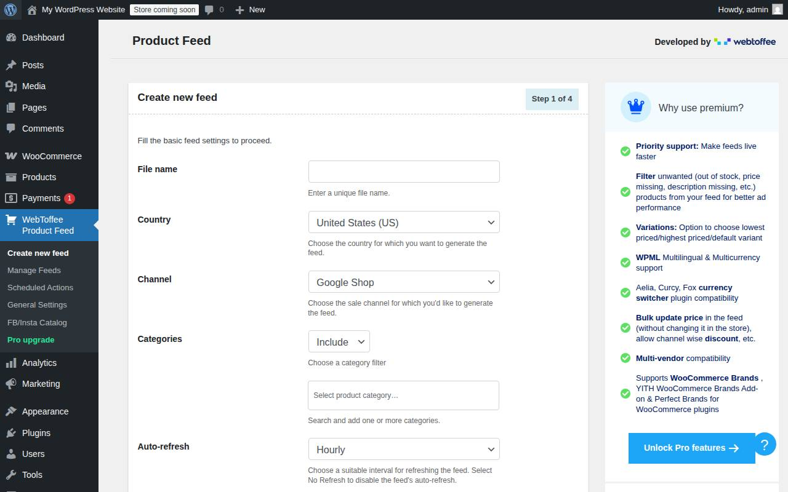

 

<h2>WordCamp Companion</h2>

A tool to help you plan your WordCamp attendance.

<small>By <a href="https://github.com/Alex Kirk">@Alex Kirk</a> • <a href="https://github.com/wordpress/blueprints/blob/trunk/blueprints/wordcamp-companion/blueprint.json">View source</a> • <a href="https://playground.wordpress.net/builder/builder.html?blueprint-url=https://raw.githubusercontent.com/wordpress/blueprints/33d0f14c1c330d5e9571081fc160b39362204117/blueprints/wordcamp-companion/blueprint.json">Edit</a></small>

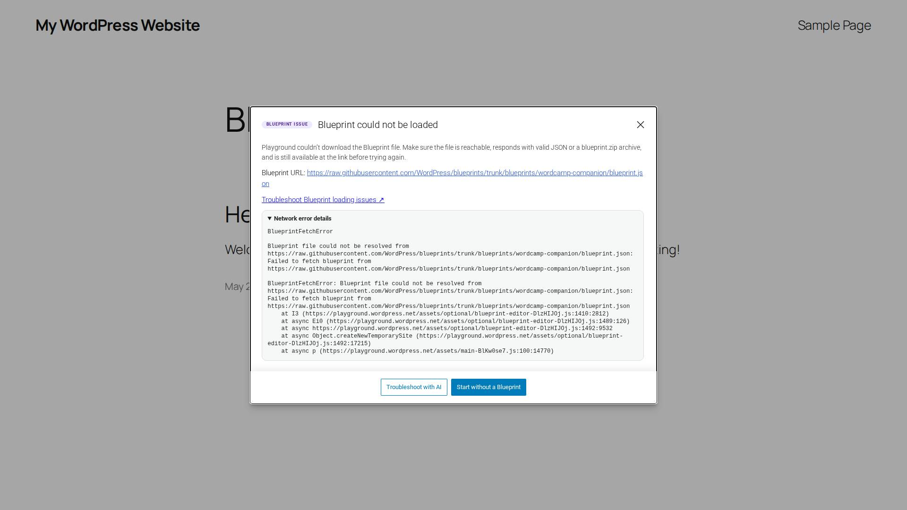

 

<h2>WordPress Beta</h2>

Test the latest WordPress Beta or RC release with theme test data and debugging plugins. Only loads the Beta version during the Beta period.

<small>By <a href="https://github.com/courtneyr-dev">@courtneyr-dev</a> • <a href="https://github.com/wordpress/blueprints/blob/trunk/blueprints/beta-rc/blueprint.json">View source</a> • <a href="https://playground.wordpress.net/builder/builder.html?blueprint-url=https://raw.githubusercontent.com/wordpress/blueprints/d17b1bb6a5f6b2b3293625804a4f2a73284052f3/blueprints/beta-rc/blueprint.json">Edit</a></small>

 

<h2>Wordopedia</h2>

Search, browse, and save Wikipedia articles and snippets.

<small>By <a href="https://github.com/Alex Kirk">@Alex Kirk</a> • <a href="https://github.com/wordpress/blueprints/blob/trunk/blueprints/wordopedia/blueprint.json">View source</a> • <a href="https://playground.wordpress.net/builder/builder.html?blueprint-url=https://raw.githubusercontent.com/wordpress/blueprints/26507076d7a5042627d039fc2a10af8332295413/blueprints/wordopedia/blueprint.json">Edit</a></small>

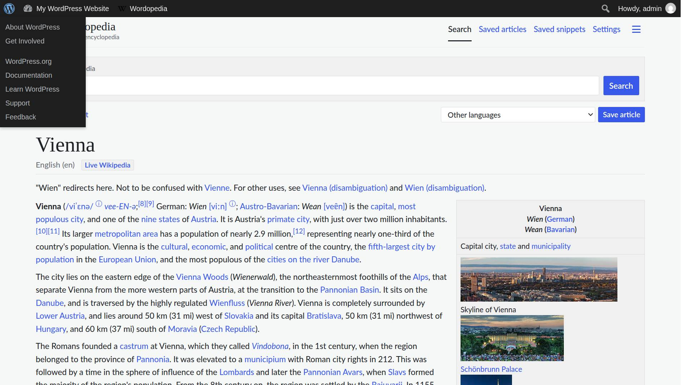

 

