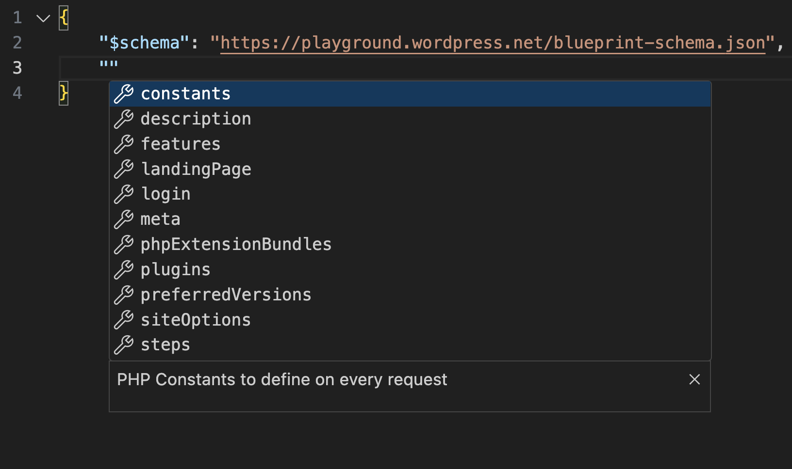
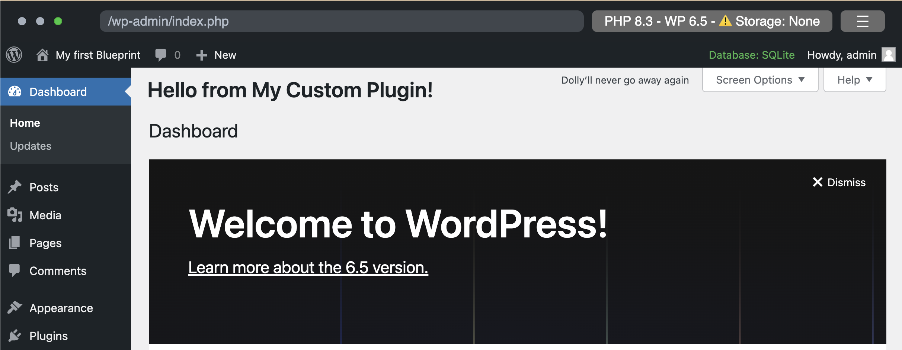

## Build your first Blueprint

Let's build an elementary Blueprint that

1. Creates a new WordPress site
2. Sets the site title to "My first Blueprint"
3. Installs the _Adventurer_ theme
4. Installs the _Hello Dolly_ plugin from the WordPress plugin directory
5. Installs a custom plugin
6. Changes the site content

### 1. Create a new WordPress site

Let's start by creating a `blueprint.json` file with the following contents:

```json
{}
```

It may seem like nothing is happening, but this Blueprint already spins up a WordPress site with the latest major version.

[<kbd> <br>Run Blueprint<br> </kbd>](https://playground.wordpress.net/#{})

> [!TIP]
> **Autocomplete**
>
>If you use an IDE, like VS Code or PHPStorm, you can use the [Blueprint JSON Schema](https://playground.wordpress.net/blueprint-schema.json) for an autocompleted Blueprint development experience. Add the following line at the top of your `blueprint.json` file:
>
>```json
>{
>    "$schema": "https://playground.wordpress.net/blueprint-schema.json"
>}
>```

Here's what it looks like in VS Code:



### 2. Set the site title to "My first Blueprint"

Blueprints consist of a series of [steps](https://wordpress.github.io/wordpress-playground/blueprints-api/steps) that define how to build a WordPress site. Before you write the first step, declare an empty list of steps:

```json
{
    "$schema": "https://playground.wordpress.net/blueprint-schema.json",
    "steps": []
}
```

This Blueprint isn't very exciting—it creates the same default site as the empty Blueprint above. Let's do something about it!

WordPress stores the site title in the `blogname` option. Add your first step and set that option to "My first Blueprint":

```json
{
    "$schema": "https://playground.wordpress.net/blueprint-schema.json",
    "steps": [
        {
            "step": "setSiteOptions",
            "options": {
                "blogname": "My first Blueprint"
            }
        }
    ]
}
```

[<kbd> <br>Run Blueprint<br> </kbd>](https://playground.wordpress.net/#eyIkc2NoZW1hIjoiaHR0cHM6Ly9wbGF5Z3JvdW5kLndvcmRwcmVzcy5uZXQvYmx1ZXByaW50LXNjaGVtYS5qc29uIiwic3RlcHMiOlt7InN0ZXAiOiJzZXRTaXRlT3B0aW9ucyIsIm9wdGlvbnMiOnsiYmxvZ25hbWUiOiJNeSBmaXJzdCBCbHVlcHJpbnQifX1dfQ==)

The [`setSiteOptions` step](https://wordpress.github.io/wordpress-playground/blueprints-api/steps#SetSiteOptionsStep) specifies the site options in the WordPress database. The `options` object contains the key-value pairs to set. In this case, you changed the value of the `blogname` key to "My first Blueprint". You can read more about all available steps in the [Blueprint Steps API Reference](https://wordpress.github.io/wordpress-playground/blueprints-api/steps).

### Shorthands

You can specify some steps using a shorthand syntax. For example, you could write the `setSiteOptions` step like this:

```json
{
    "$schema": "https://playground.wordpress.net/blueprint-schema.json",
    "siteOptions": {
        "blogname": "My first Blueprint"
    }
}
```

Every step specified with the shorthand syntax is automatically added at the beginning of the Blueprint's execution, before any explicitly defined `steps` array. The order among multiple shorthands is not guaranteed. Which should you choose? Use shorthands when brevity is your main concern, and use explicit steps when you require more control over the order of execution.

### 3. Install the _Adventurer_ theme

Adventurer is an open-source theme [available in the WordPress theme directory](https://wordpress.org/themes/adventurer/). Let's install it using the [`installTheme` step](https://wordpress.github.io/wordpress-playground/blueprints-api/steps#InstallThemeStep):

```json
{
    "siteOptions": {
        "blogname": "My first Blueprint"
    },
    "steps": [
        {
            "step": "installTheme",
            "themeData": {
                "resource": "wordpress.org/themes",
                "slug": "adventurer"
            }
        }
    ]
}
```

[<kbd> <br>Run Blueprint<br> </kbd>](https://playground.wordpress.net/#eyJzaXRlT3B0aW9ucyI6eyJibG9nbmFtZSI6Ik15IGZpcnN0IEJsdWVwcmludCJ9LCJzdGVwcyI6W3sic3RlcCI6Imluc3RhbGxUaGVtZSIsInRoZW1lRGF0YSI6eyJyZXNvdXJjZSI6IndvcmRwcmVzcy5vcmcvdGhlbWVzIiwic2x1ZyI6ImFkdmVudHVyZXIifX1dfQ==)

The site should now look like the screenshot below:


### Resources

The `themeData` defines a [resource](https://wordpress.github.io/wordpress-playground/blueprints-api/resources/) and references an external file required to complete the step. Playground supports different types of resources, including
- `url`,
- `wordpress.org/themes`,
- `wordpress.org/plugins`,
- `vfs`(virtual file system), or
- `literal`.

The example uses the `wordpress.org/themes` resource, which requires a `slug` identical to the one used in WordPress theme directory:

In this case, `https://wordpress.org/themes/<slug>/` becomes `https://wordpress.org/themes/adventurer/`.

> [!NOTE]
> Learn more about the supported resources in the [Blueprint Resources API Reference](https://wordpress.github.io/wordpress-playground/blueprints-api/resources/).

### 4. Install the _Hello Dolly_ plugin

A classic WordPress plugin that displays random lyrics from the song "Hello, Dolly!" in the admin dashboard. Let's install it using the [`installPlugin` step](https://wordpress.github.io/wordpress-playground/blueprints-api/steps#InstallPluginStep):

```json
{
    "siteOptions": {
        "blogname": "My first Blueprint"
    },
    "steps": [
        {
            "step": "installTheme",
            "themeData": {
                "resource": "wordpress.org/themes",
                "slug": "adventurer"
            }
        },
        {
            "step": "installPlugin",
            "pluginData": {
                "resource": "wordpress.org/plugins",
                "slug": "hello-dolly"
            }
        }
    ]
}
```

[<kbd> <br>Run Blueprint<br> </kbd>](https://playground.wordpress.net/#eyJzaXRlT3B0aW9ucyI6eyJibG9nbmFtZSI6Ik15IGZpcnN0IEJsdWVwcmludCJ9LCJzdGVwcyI6W3sic3RlcCI6Imluc3RhbGxUaGVtZSIsInRoZW1lRGF0YSI6eyJyZXNvdXJjZSI6IndvcmRwcmVzcy5vcmcvdGhlbWVzIiwic2x1ZyI6ImFkdmVudHVyZXIifX0seyJzdGVwIjoiaW5zdGFsbFBsdWdpbiIsInBsdWdpbkRhdGEiOnsicmVzb3VyY2UiOiJ3b3JkcHJlc3Mub3JnL3BsdWdpbnMiLCJzbHVnIjoiaGVsbG8tZG9sbHkifX1dfQ==)

The Hello Dolly plugin is now installed and activated.

Like the `themeData`, the `pluginData` defines a reference to an external file required for the step. The example uses the `wordpress.org/plugins` resource to install the plugin with the matching `slug` from the WordPress plugin directory.

### 5. Install a custom plugin

Let's install a custom WordPress plugin that adds a message to the admin dashboard:

```php
<?php
/*
Plugin Name: "Hello" on the Dashboard
Description: A custom plugin to showcase WordPress Blueprints
Version: 1.0
Author: WordPress Contributors
*/

function my_custom_plugin() {
    echo '<h1>Hello from My Custom Plugin!</h1>';
}

add_action('admin_notices', 'my_custom_plugin');
```

While you could use the [installPlugin](https://wordpress.github.io/wordpress-playground/blueprints-api/steps#InstallPluginStep) step for this, it typically requires creating a ZIP file. To demonstrate direct file creation and activation, let's start with something different:

1. Create a `wp-content/plugins/hello-from-the-dashboard` directory using the [`mkdir` step](https://wordpress.github.io/wordpress-playground/blueprints-api/steps#MkdirStep).
2. Write a `plugin.php` file using the [`writeFile` step](https://wordpress.github.io/wordpress-playground/blueprints-api/steps#WriteFileStep). 
3. Activate the plugin using the [`activatePlugin` step](https://wordpress.github.io/wordpress-playground/blueprints-api/steps#ActivatePluginStep).

Here's what that looks like in a Blueprint:

```json
{
    // ...
    "steps": [
        // ...
        {
            "step": "mkdir",
            "path": "/wordpress/wp-content/plugins/hello-from-the-dashboard"
        },
        {
            "step": "writeFile",
            "path": "/wordpress/wp-content/plugins/hello-from-the-dashboard/plugin.php",
            "data": "<?php\n/*\nPlugin Name: \"Hello\" on the Dashboard\nDescription: A custom plugin to showcase WordPress Blueprints\nVersion: 1.0\nAuthor: WordPress Contributors\n*/\n\nfunction my_custom_plugin() {\n    echo '<h1>Hello from My Custom Plugin!</h1>';\n}\n\nadd_action('admin_notices', 'my_custom_plugin');"
        },
        {
            "step": "activatePlugin",
            "pluginPath": "hello-from-the-dashboard/plugin.php"
        }
    ]
}
```

The last thing to do is log the user in as an admin. You can do that with a shorthand of the [`login` step](https://wordpress.github.io/wordpress-playground/blueprints-api/steps#LoginStep):

```json
{
    "login": true,
    "steps": [
        // ...
    ]
}
```

Here's the complete Blueprint:

```json
{
    "$schema": "https://playground.wordpress.net/blueprint-schema.json",
    "login": true,
    "siteOptions": {
        "blogname": "My first Blueprint"
    },
    "steps": [
        {
            "step": "installTheme",
            "themeData": {
                "resource": "wordpress.org/themes",
                "slug": "adventurer"
            }
        },
        {
            "step": "installPlugin",
            "pluginData": {
                "resource": "wordpress.org/plugins",
                "slug": "hello-dolly"
            }
        },
        {
            "step": "mkdir",
            "path": "/wordpress/wp-content/plugins/hello-from-the-dashboard"
        },
        {
            "step": "writeFile",
            "path": "/wordpress/wp-content/plugins/hello-from-the-dashboard/plugin.php",
            "data": "<?php\n/*\nPlugin Name: \"Hello\" on the Dashboard\nDescription: A custom plugin to showcase WordPress Blueprints\nVersion: 1.0\nAuthor: WordPress Contributors\n*/\n\nfunction my_custom_plugin() {\n    echo '<h1>Hello from My Custom Plugin!</h1>';\n}\n\nadd_action('admin_notices', 'my_custom_plugin');"
        },
        {
            "step": "activatePlugin",
            "pluginPath": "hello-from-the-dashboard/plugin.php"
        }
    ]
}
```

[<kbd> <br>Run Blueprint<br> </kbd>](https://playground.wordpress.net/#eyIkc2NoZW1hIjoiaHR0cHM6Ly9wbGF5Z3JvdW5kLndvcmRwcmVzcy5uZXQvYmx1ZXByaW50LXNjaGVtYS5qc29uIiwibG9naW4iOnRydWUsInNpdGVPcHRpb25zIjp7ImJsb2duYW1lIjoiTXkgZmlyc3QgQmx1ZXByaW50In0sInN0ZXBzIjpbeyJzdGVwIjoiaW5zdGFsbFRoZW1lIiwidGhlbWVEYXRhIjp7InJlc291cmNlIjoid29yZHByZXNzLm9yZy90aGVtZXMiLCJzbHVnIjoiYWR2ZW50dXJlciJ9fSx7InN0ZXAiOiJpbnN0YWxsUGx1Z2luIiwicGx1Z2luRGF0YSI6eyJyZXNvdXJjZSI6IndvcmRwcmVzcy5vcmcvcGx1Z2lucyIsInNsdWciOiJoZWxsby1kb2xseSJ9fSx7InN0ZXAiOiJta2RpciIsInBhdGgiOiIvd29yZHByZXNzL3dwLWNvbnRlbnQvcGx1Z2lucy9oZWxsby1mcm9tLXRoZS1kYXNoYm9hcmQifSx7InN0ZXAiOiJ3cml0ZUZpbGUiLCJwYXRoIjoiL3dvcmRwcmVzcy93cC1jb250ZW50L3BsdWdpbnMvaGVsbG8tZnJvbS10aGUtZGFzaGJvYXJkL3BsdWdpbi5waHAiLCJkYXRhIjoiPD9waHBcbi8qXG5QbHVnaW4gTmFtZTogXCJIZWxsb1wiIG9uIHRoZSBEYXNoYm9hcmRcbkRlc2NyaXB0aW9uOiBBIGN1c3RvbSBwbHVnaW4gdG8gc2hvd2Nhc2UgV29yZFByZXNzIEJsdWVwcmludHNcblZlcnNpb246IDEuMFxuQXV0aG9yOiBXb3JkUHJlc3MgQ29udHJpYnV0b3JzXG4qL1xuXG5mdW5jdGlvbiBteV9jdXN0b21fcGx1Z2luKCkge1xuICAgIGVjaG8gJzxoMT5IZWxsbyBmcm9tIE15IEN1c3RvbSBQbHVnaW4hPC9oMT4nO1xufVxuXG5hZGRfYWN0aW9uKCdhZG1pbl9ub3RpY2VzJywgJ215X2N1c3RvbV9wbHVnaW4nKTsifSx7InN0ZXAiOiJhY3RpdmF0ZVBsdWdpbiIsInBsdWdpblBhdGgiOiJoZWxsby1mcm9tLXRoZS1kYXNoYm9hcmQvcGx1Z2luLnBocCJ9XX0=)

That's what it looks like when you navigate to the dashboard:



### Create a plugin and zip it

Encoding PHP files as `JSON` can be useful for quick testing, but it's inconvenient and difficult to read. Instead, create a file with the plugin code, compress it, and use the `ZIP` file as the `resource` in the [`installPlugin` step](https://wordpress.github.io/wordpress-playground/blueprints-api/steps#InstallPluginStep) to install it (the path in the `URL` should match the one in your GitHub repository):


```json
{
    "$schema": "https://playground.wordpress.net/blueprint-schema.json",
    "login": true,
    "siteOptions": {
        "blogname": "My first Blueprint"
    },
    "steps": [
        {
            "step": "installTheme",
            "themeData": {
                "resource": "wordpress.org/themes",
                "slug": "adventurer"
            }
        },
        {
            "step": "installPlugin",
            "pluginData": {
                "resource": "wordpress.org/plugins",
                "slug": "hello-dolly"
            }
        },
        {
            "step": "installPlugin",
            "pluginData": {
                "resource": "url",
                "url": "https://raw.githubusercontent.com/wordpress/blueprints/trunk/docs/assets/hello-from-the-dashboard.zip"
            }
        }
    ]
}
```

You can shorten that Blueprint even more using the shorthand syntax:

```json
{
    "$schema": "https://playground.wordpress.net/blueprint-schema.json",
    "login": true,
    "siteOptions": {
        "blogname": "My first Blueprint"
    },
    "plugins": [
        "hello-dolly",
        "https://raw.githubusercontent.com/wordpress/blueprints/trunk/docs/assets/hello-from-the-dashboard.zip"
    ],
    "steps": [
        {
            "step": "installTheme",
            "themeData": {
                "resource": "wordpress.org/themes",
                "slug": "adventurer"
            }
        }
    ]
}
```

[<kbd> <br>Run Blueprint<br> </kbd>](https://playground.wordpress.net/#eyIkc2NoZW1hIjoiaHR0cHM6Ly9wbGF5Z3JvdW5kLndvcmRwcmVzcy5uZXQvYmx1ZXByaW50LXNjaGVtYS5qc29uIiwibG9naW4iOnRydWUsInNpdGVPcHRpb25zIjp7ImJsb2duYW1lIjoiTXkgZmlyc3QgQmx1ZXByaW50In0sInBsdWdpbnMiOlsiaGVsbG8tZG9sbHkiLCJodHRwczovL3Jhdy5naXRodWJ1c2VyY29udGVudC5jb20vd29yZHByZXNzL2JsdWVwcmludHMvdHJ1bmsvZG9jcy9hc3NldHMvaGVsbG8tZnJvbS10aGUtZGFzaGJvYXJkLnppcCJdLCJzdGVwcyI6W3sic3RlcCI6Imluc3RhbGxUaGVtZSIsInRoZW1lRGF0YSI6eyJyZXNvdXJjZSI6IndvcmRwcmVzcy5vcmcvdGhlbWVzIiwic2x1ZyI6ImFkdmVudHVyZXIifX1dfQ==)

### 6. Change the site content

Finally, let's delete the default content of the site and import a new one from a WordPress export file (WXR).

### Delete the old content

While there isn't a dedicated Blueprint step to delete default content, you can achieve this using a snippet of PHP code via the `runPHP` step:

```php
<?php
require '/wordpress/wp-load.php';

// Delete all posts and pages
$posts = get_posts(array(
    'numberposts' => -1,
    'post_type' => array('post', 'page'),
    'post_status' => 'any'
));

foreach ($posts as $post) {
    wp_delete_post($post->ID, true);
}
```

To run that code during the site setup, use the [`runPHP` step](https://wordpress.github.io/wordpress-playground/blueprints-api/steps#RunPHPStep):


```json
{
    // ...
    "steps": [
        // ...
        {
            "step": "runPHP",
            "code": "<?php\nrequire '/wordpress/wp-load.php';\n\n$posts = get_posts(array(\n    'numberposts' => -1,\n    'post_type' => array('post', 'page'),\n    'post_status' => 'any'\n));\n\nforeach ($posts as $post) {\n    wp_delete_post($post->ID, true);\n}"
        }
    ]
}
```

### Import the new content

Let's use the [`importWxr` step](https://wordpress.github.io/wordpress-playground/blueprints-api/steps#ImportWXRStep) to import a WordPress export (`WXR`) file that helps test WordPress themes. The file is available in the [WordPress/theme-test-data](https://github.com/WordPress/theme-test-data) repository, and you can access it via its `raw.githubusercontent.com` address: [https://raw.githubusercontent.com/WordPress/theme-test-data/master/themeunittestdata.wordpress.xml](https://raw.githubusercontent.com/WordPress/theme-test-data/master/themeunittestdata.wordpress.xml).

Here's what the final Blueprint looks like:

```json
{
    "$schema": "https://playground.wordpress.net/blueprint-schema.json",
    "login": true,
    "siteOptions": {
        "blogname": "My first Blueprint"
    },
    "plugins": [
        "hello-dolly",
        "https://raw.githubusercontent.com/wordpress/blueprints/trunk/docs/assets/hello-from-the-dashboard.zip"
    ],
    "steps": [
        {
            "step": "installTheme",
            "themeData": {
                "resource": "wordpress.org/themes",
                "slug": "adventurer"
            }
        },
        {
            "step": "runPHP",
            "code": "<?php\nrequire '/wordpress/wp-load.php';\n\n$posts = get_posts(array(\n    'numberposts' => -1,\n    'post_type' => array('post', 'page'),\n    'post_status' => 'any'\n));\n\nforeach ($posts as $post) {\n    wp_delete_post($post->ID, true);\n}"
        },
        {
            "step": "importWxr",
            "file": {
                "resource": "url",
                "url": "https://raw.githubusercontent.com/WordPress/theme-test-data/master/themeunittestdata.wordpress.xml"
            }
        }
    ]
}
```

[<kbd> <br>Run Blueprint<br> </kbd>](https://playground.wordpress.net/#eyIkc2NoZW1hIjoiaHR0cHM6Ly9wbGF5Z3JvdW5kLndvcmRwcmVzcy5uZXQvYmx1ZXByaW50LXNjaGVtYS5qc29uIiwibG9naW4iOnRydWUsInNpdGVPcHRpb25zIjp7ImJsb2duYW1lIjoiTXkgZmlyc3QgQmx1ZXByaW50In0sInBsdWdpbnMiOlsiaGVsbG8tZG9sbHkiLCJodHRwczovL3Jhdy5naXRodWJ1c2VyY29udGVudC5jb20vd29yZHByZXNzL2JsdWVwcmludHMvdHJ1bmsvZG9jcy9hc3NldHMvaGVsbG8tZnJvbS10aGUtZGFzaGJvYXJkLnppcCJdLCJzdGVwcyI6W3sic3RlcCI6Imluc3RhbGxUaGVtZSIsInRoZW1lRGF0YSI6eyJyZXNvdXJjZSI6IndvcmRwcmVzcy5vcmcvdGhlbWVzIiwic2x1ZyI6ImFkdmVudHVyZXIifX0seyJzdGVwIjoicnVuUEhQIiwiY29kZSI6Ijw/cGhwXG5yZXF1aXJlICcvd29yZHByZXNzL3dwLWxvYWQucGhwJztcblxuJHBvc3RzID0gZ2V0X3Bvc3RzKGFycmF5KFxuICAgICdudW1iZXJwb3N0cycgPT4gLTEsXG4gICAgJ3Bvc3RfdHlwZScgPT4gYXJyYXkoJ3Bvc3QnLCAncGFnZScpLFxuICAgICdwb3N0X3N0YXR1cycgPT4gJ2FueSdcbikpO1xuXG5mb3JlYWNoICgkcG9zdHMgYXMgJHBvc3QpIHtcbiAgICB3cF9kZWxldGVfcG9zdCgkcG9zdC0+SUQsIHRydWUpO1xufSJ9LHsic3RlcCI6ImltcG9ydFd4ciIsImZpbGUiOnsicmVzb3VyY2UiOiJ1cmwiLCJ1cmwiOiJodHRwczovL3Jhdy5naXRodWJ1c2VyY29udGVudC5jb20vV29yZFByZXNzL3RoZW1lLXRlc3QtZGF0YS9tYXN0ZXIvdGhlbWV1bml0dGVzdGRhdGEud29yZHByZXNzLnhtbCJ9fV19)

And that's it. Congratulations on creating your first Blueprint! 🥳

***

**Table of contents**
1. [What are Blueprints, and what can you do with them?](./what-are-blueprints-what-you-can-do-with-them.md)
2. [How to load and run Blueprints?](./how-to-load-run-blueprints.md)
3. 👉 Build your first Blueprint
4. [Troubleshoot and debug Blueprints](./troubleshoot-debug-blueprints.md)
